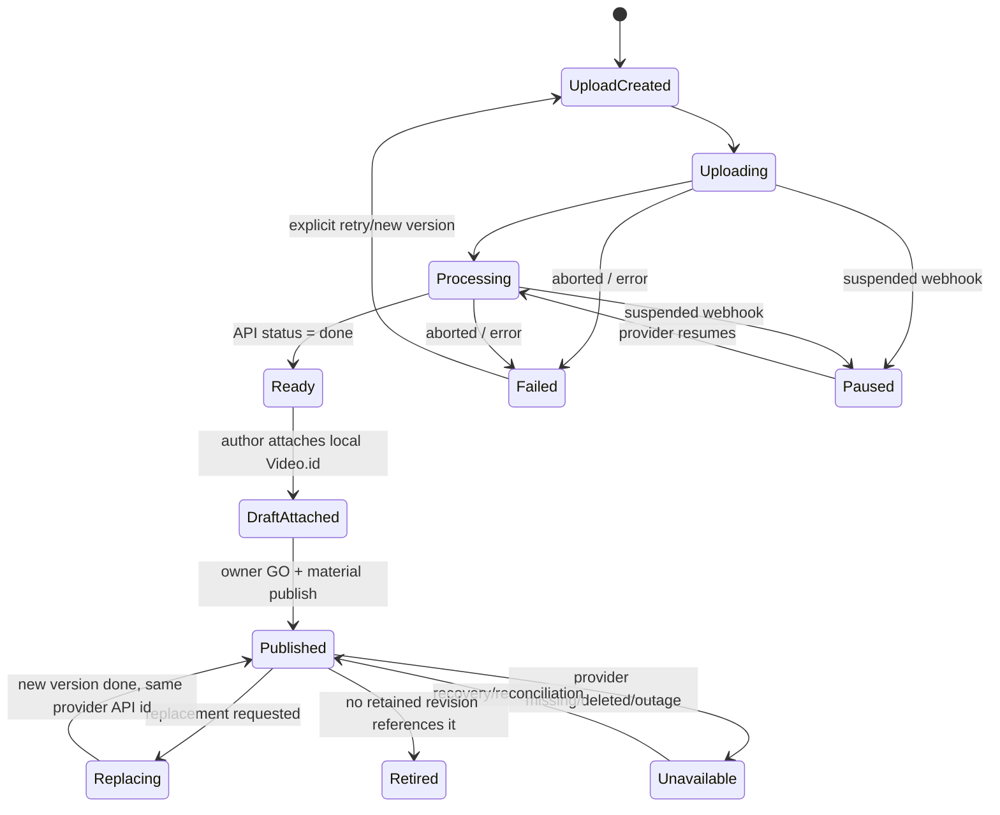
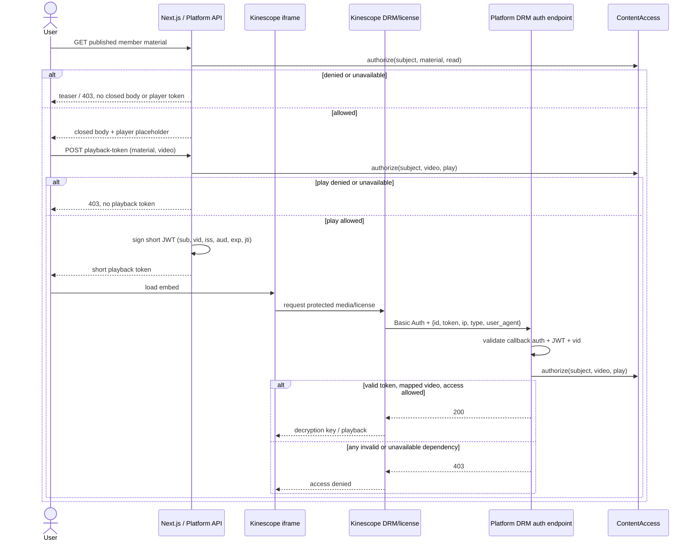

# Kinescope: lifecycle закрытого видео для Platform v1

Статус: принятое owner decision — Kinescope выбран video provider для Platform v1; production
adapter проходит перечисленные ниже integration acceptance checks.

Дата проверки источников и публичных endpoint: 2026-08-21.

Основание: [Workspace issue #42](https://github.com/sachkov-inside/workspace/issues/42) и
[`product/platform-mvp-brief.md`](../../product/platform-mvp-brief.md).

## Решение в одном абзаце

Для Platform v1 **выбран Kinescope** с уже существующими account и тарифом. Рекомендуемый путь —
resumable browser upload по Tus через server-side init, локальная сущность `Video` с opaque
`providerApiVideoId` и отдельно полученным embed locator, webhook как ускоритель плюс обязательный
polling/reconciliation до `done`, и publish только после проверки готовности. Kinescope
authorization backend остаётся provider-specific механизмом: при его использовании license
выдаётся fail-closed только с `strict: true`; при `strict: false` любой ответ кроме 403 разрешает
просмотр
([API: DRM auth](https://docs.kinescope.com/api/#v1-drm-update-auth)).

Общая политика «кто может читать, скачивать, preview-ить или воспроизводить закрытый ресурс» не
принадлежит Kinescope и проектируется отдельно в
[Workspace issue #54](https://github.com/sachkov-inside/workspace/issues/54). Этот отчёт фиксирует
возможности и adapter contract Kinescope; account-backed проверки callback cadence, webhook,
replacement и deletion становятся acceptance checks production integration, а не блокером выбора
provider. Application ADR создаётся в Platform после первого зелёного adapter proof, не в
Workspace.

## Что является authority

| Факт | Authority |
|---|---|
| Доступ пользователя к закрытому material/video | Application-owned `ContentAccess`; Membership может быть одним из policy inputs, Kinescope не является authority |
| Draft/published | Platform revision и `publishedRevisionId`; provider status этого не заменяет |
| Identity видео | Локальный `Video.id`; отдельно opaque API/callback `data.id` и возвращённый provider embed locator |
| Upload/processing status | Последний подтверждённый API snapshot; webhook только ускоряет обновление |
| Файл и playback rendition | Kinescope; исходник отдельно сохраняется для recovery/vendor exit |
| Разрешение license | Platform authorization backend, вызванный Kinescope, делегирует решение в `ContentAccess` |

API возвращает у video отдельные `id`, `project_id`, `status`, `progress`, `play_link` и
`embed_link`; возможные API status — `pending`, `uploading`, `pre-processing`, `processing`,
`aborted`, `done`, `error` ([API: video object](https://docs.kinescope.com/api/)). ID надо считать
opaque string: в официальных примерах встречаются и UUID, и другие строковые формы, а playback
locator внутри возвращённых links выглядит иначе. Поэтому integration не синтезирует embed URL из
API ID: хранит API/callback ID и provider-returned embed locator отдельно, а spike доказывает их
связь. В canonical content node хранится только локальный `Video.id`, но не iframe HTML, API token,
provider link, HLS link или краткоживущий playback token.

## Целевой lifecycle



`suspended` присутствует в официальном списке webhook statuses, но отсутствует в enum video object.
Поэтому adapter принимает известное объединение значений, а любой новый status трактует как
`not ready`, сохраняет raw value и поднимает alert, вместо optimistic publish
([webhook types](https://docs.kinescope.com/developer-guides/webhook-types/),
[API: video object](https://docs.kinescope.com/api/#v1-videos)).

### Последовательность загрузки и публикации

```mermaid
sequenceDiagram
    actor Author
    participant Admin as Platform Admin
    participant API as Platform API
    participant Uploader as Kinescope Uploader
    participant KAPI as Kinescope API
    participant Worker as Platform Worker
    participant DB as Platform DB

    Author->>Admin: choose file + metadata
    Admin->>API: POST /admin/videos/uploads (name, size, type)
    API->>API: author auth, size/type/parent allowlist
    API->>Uploader: POST /v2/init (server Bearer token)
    Uploader-->>API: provider video id + Tus endpoint
    API->>DB: create Video(status=uploading)
    API-->>Admin: one-use upload endpoint + local Video.id
    Admin->>Uploader: Tus chunks directly
    Uploader-->>Admin: offsets/progress
    Uploader-->>API: media.update.status webhook
    API->>DB: append inbox event; acknowledge
    Worker->>KAPI: GET /v1/videos/{providerApiVideoId}
    KAPI-->>Worker: authoritative status/metadata
    Worker->>DB: update snapshot/status
    Author->>API: attach local Video.id to draft revision
    Author->>API: preview exact draft revision
    Author->>API: publish after explicit owner GO
    API->>DB: require status=ready; move published pointer
```

Kinescope рекомендует Tus для больших файлов. Backend вызывает `POST
https://uploader.kinescope.io/v2/init`, не передаёт API token браузеру, а сам файл затем идёт из
браузера напрямую в выданный Tus endpoint; загрузку можно возобновлять после разрыва
([Tus guide](https://docs.kinescope.com/developer-guides/tus-protocol-implementation/)). Это
предпочтительный v1 path. Single-request upload оставляется для небольших trusted server jobs, а
URL import — для контролируемой миграции из доступного источника
([file upload guide](https://docs.kinescope.com/developer-guides/file-upload-via-api/)).

## API credentials и upload boundary

Каждый Kinescope API token привязан к одному workspace; он передаётся как `Authorization: Bearer`
и не должен попадать в client-side code. Kinescope рекомендует отдельный token на integration для
независимой rotation/revocation. API reference также позволяет создать upload-only token для
конкретного project ([general API rules](https://docs.kinescope.com/developer-guides/api-general-rules/),
[API: access tokens](https://docs.kinescope.com/api/#v1-access-tokens-create-upload-token-to-specific-project)).

Рекомендуемая граница:

1. `KINESCOPE_UPLOAD_TOKEN` — только server-side init/upload scope и фиксированный v1 project.
2. `KINESCOPE_MANAGEMENT_TOKEN` — read/update video, privacy, webhook и DRM configuration; никогда
   не используется browser/admin напрямую.
3. Secrets хранятся в runtime secret store, не в database, logs, issue, PR или content document.
4. Platform endpoint сам задаёт `parent_id`; клиент не выбирает произвольный Kinescope project.
5. Upload init проверяет author session, filename/title, declared bytes, MIME allowlist и quota до
   обращения к provider.
6. Возвращается только выданный upload endpoint и локальный `Video.id`. Long-lived Bearer token в
   браузер не возвращается.

У `POST /v2/init` и URL/single-request upload не документирован idempotency key. Перед каждым
provider POST Platform создаёт `UploadAttempt` с локальным ID, checksum/size/source metadata и
requested parent. Timeout после отправки не ретраится вслепую: worker сначала ищет/correlates
созданный video, иначе author явно запускает новый attempt. Это предотвращает silent duplicates
при неизвестном результате запроса.

Kinescope публикует общие limits 10 requests/s, 300 requests/min, request body 10 MB и до примерно
100 list items/page; upload bytes идут через отдельный uploader/Tus path. На 429 надо уважать
`Retry-After`, на timeout/5xx — bounded exponential backoff, а 4xx кроме 429 не ретраить
([general API rules](https://docs.kinescope.com/developer-guides/api-general-rules/),
[API error handling](https://docs.kinescope.com/api/#errors)).

## Processing, webhooks и reconciliation

`media.update.status` передаёт `data.id`, `data.status` и иногда `message`; documented statuses —
`pending`, `uploading`, `pre-processing`, `processing`, `aborted`, `done`, `error`, `suspended`.
`done` — единственное состояние, разрешающее attach-ready/publish; `progress` не является
готовностью ([webhook types](https://docs.kinescope.com/developer-guides/webhook-types/)).

Webhook нельзя делать единственным authority:

- публичный guide говорит только, что на non-200 provider *может* повторить запрос, но не задаёт
  retry schedule, maximum attempts, ordering или delivery ID;
- API reference называет POST «signed», однако не документирует header, algorithm, canonical
  payload или key rotation; зато create/update webhook явно поддерживает HTTP Basic credentials
  ([API: webhooks](https://docs.kinescope.com/api/#v1-webhooks-create-webhook),
  [webhook guide](https://docs.kinescope.com/developer-guides/webhook-types/));
- payload не содержит documented event timestamp/version, поэтому порядок arrival нельзя считать
  порядком state transition.

До разъяснения signature contract endpoint использует HTTPS + случайные Basic credentials,
ограничивает body/timeout, сохраняет raw payload hash и `receivedAt`, быстро пишет inbox и отвечает
200. Worker перечитывает `GET /v1/videos/{id}` после события. Дополнительно polling проверяет
незавершённые записи после upload и периодически reconciles опубликованные provider IDs. Duplicate,
unknown и backward-looking webhook не меняет состояние без API confirmation.

### Минимальная локальная модель

```ts
type VideoId = string & { readonly __type: 'VideoId' }
type KinescopeVideoId = string & { readonly __type: 'KinescopeVideoId' }
type KinescopeProjectId = string & { readonly __type: 'KinescopeProjectId' }
type KinescopeEmbedUrl = string & { readonly __type: 'KinescopeEmbedUrl' }
type ProviderStatus = string & { readonly __type: 'ProviderStatus' }
type Instant = string & { readonly __type: 'Instant' }

type Video = {
  id: VideoId
  provider: 'kinescope'
  providerApiVideoId: KinescopeVideoId
  providerProjectId: KinescopeProjectId
  providerEmbedUrl: KinescopeEmbedUrl | null
  status: 'uploading' | 'processing' | 'ready' | 'failed' | 'paused' | 'unavailable' | 'retired'
  providerStatus: ProviderStatus
  title: string
  durationSeconds: number | null
  version: number | null
  lastProviderSyncAt: Instant
  lastErrorCode: string | null
  lastErrorDetail: string | null
}
```

В production к этому нужны append-only `VideoEvent`/webhook inbox, actor/request IDs и ссылки
content revisions. Не сохраняются raw Bearer/API tokens, full playback JWT, signed asset URLs и
HLS links.

## Draft, preview и publish

Kinescope upload parameter `preview` создаёт отдельный короткий MP4 clip по адресу вида
`/{video_id}/preview`; это **не** Platform draft preview
([file upload guide](https://docs.kinescope.com/developer-guides/file-upload-via-api/)). Поэтому:

- upload parameter `preview` для закрытого v1 выключен, пока live-spike не докажет, что clip
  наследует DRM, domain restriction и authorization backend без bypass;
- provider video с момента создания получает production protection; draft не означает public;
- author preview рендерит точную Platform revision тем же allowlisted player component и тем же
  authorization backend, но author access проверяется отдельным application permission;
- published member page берёт только `publishedRevisionId`; draft replacement не появляется в нём;
- publish command требует provider status `done`, существующий video lookup, разрешённый project,
  expected privacy/domain/DRM settings и явный owner GO;
- free/public material не переиспользует закрытый provider object по умолчанию: protection policy
  должна быть очевидной на уровне отдельного Video/project, а не меняться при publish.

## Защищённое воспроизведение

Ниже описан provider adapter flow. Решение о доступе принимает application-owned
`ContentAccess` из #54; Kinescope получает только короткоживущий результат этого решения и не
становится authority для Membership или других закрытых ресурсов.

### Последовательность



Официальный contract передаёт `drmauthtoken` в embed URL, после чего Kinescope отправляет на
Platform HTTP request с JSON `id`, `token`, `ip`, `type`, `user_agent`; 200 разрешает license, 403
запрещает. Публичная страница не фиксирует method, timeout и retries — их надо снять в live-spike.
Kinescope
прямо рекомендует signed JWT и проверку `exp`, `aud`, `iss`
([authorization backend](https://docs.kinescope.com/developer-guides/authorization-backend/)).

### Fail-closed policy

1. Kinescope DRM auth config всегда `strict: true`. При `false` 400/401/404/5xx разрешат license;
   это несовместимо с fail-closed доступом к закрытому ресурсу.
2. Callback защищён отдельным random Basic secret, который задаётся в DRM auth config. Неверный
   callback credential получает 401; application denial после валидного callback — 403.
3. JWT подписывается server-side approved algorithm/key. Обязательны `iss`, `aud`, `sub`, `exp` и
   custom `vid`; `vid` сравнивается с callback `id`. `jti` нужен для correlation/revocation audit.
4. TTL — короткий (spike начинает с 60–120 секунд) и не выходит за границу актуальности access
   decision, которую определит #54. JWT подписан, но не зашифрован: в claims нет email, Telegram
   ID, имени или других PII.
5. Raw JWT и query string не пишутся в application/access logs. Логируются `jti`/hash, local user
   ID, provider video ID, decision, reason code, policy snapshot/version и latency.
6. Callback повторно вызывает `ContentAccess`, а не доверяет policy claim внутри token. Unknown
   mapping, policy dependency timeout, malformed body/token, expired token и provider mismatch
   всегда дают 403.
7. Domain allowlist — defense in depth, не application authorization. Private link не используется:
   документация прямо говорит, что он может обходить domain restrictions
   ([access restrictions](https://docs.kinescope.com/content-protection/access-restrictions/)).

API examples ответа GET/PUT DRM auth не возвращают `strict`, поэтому production configuration
нельзя считать доказанной одним read-back. Spike отдельно вызывает callback с 500/timeout и
подтверждает, что playback реально заблокирован.

Открытая гарантия: docs не задают, как часто Kinescope повторно вызывает authorization backend во
время уже начатого просмотра и когда истекает выданная license. Поэтому «доступ отозван — уже
запущенный stream немедленно остановился» нельзя обещать до live-теста. Гарантируется запрет нового
page/player/license flow; maximum continued-play window должен измерить spike и передать в #54.

## Player/embed в Next.js

Для basic embed Kinescope требует iframe `allow` как минимум для autoplay/fullscreen/PiP/DRM; player
responsive к ширине container, поддерживает `loading="lazy"`, keyboard parameter, subtitles и
`dnt` для отключения activity metrics
([simple iframe embed](https://docs.kinescope.com/player-docs/embedding/simple-iframe-embed/)).
Official React package использует iframe/IFrame API, имеет `drmAuthToken`, events и методы; в
Next.js vendor требует client-side loading с отключённым SSR
([React player](https://docs.kinescope.com/player-docs/libraries/react/)).

Рекомендация для v1:

- закрытый Server Component вызывает `ContentAccess` и отдаёт body/player placeholder без token
  только при `access allowed`;
- маленький Client Component оборачивает official React player, потому что MVP требует history/read
  progress и package предоставляет `onReady`, `onTimeUpdate`, `onEnded`, `onError`;
- token выпускается same-origin endpoint после повторной authorization, не попадает в static/RSC
  cache; изменение `drmAuthToken` в official wrapper обновляет player options, но refresh и license
  renewal всё равно проверяются E2E;
- wrapper резервирует aspect ratio, имеет видимый unavailable/error state и не рендерит player до
  успешного page authorization;
- реальный iframe получает осмысленный DOM `title`; vendor React `title` — metadata видео и не
  доказан как accessible iframe name. Spike проверяет получившийся DOM; если wrapper не даёт
  стабильного hook, v1 использует owned iframe + official IFrame API вместо brittle DOM patch;
  captions/subtitles включены, keyboard controls не отключаются, focus/fullscreen проверяются
  вручную;
- application progress events минимизируются и не содержат raw player token. Simple iframe
  поддерживает `dnt=true`, но current React wrapper не публикует этот prop; если provider analytics
  не принят отдельным privacy decision, final component использует owned iframe + official IFrame
  API либо получает подтверждённый wrapper path, а не молча включает tracking;
- CSP allowlist ограничивает Kinescope frame/script/media origins после наблюдения реального
  network trace на staging.

Эти два wrapper ограничения проверены по first-party source: published props передают video
metadata `title`, но не documented DOM iframe title или `dnt`, а loader URL указывает на
`https://player.kinescope.io/latest/iframe.player.js`
([React wrapper source](https://github.com/kinescope/react-kinescope-player/blob/main/src/player.tsx),
[constants](https://github.com/kinescope/react-kinescope-player/blob/main/src/constant.ts)). Это
ещё одна причина иметь staging player smoke и читать
[player changelog](https://docs.kinescope.com/player-docs/changelog/): npm version сама по себе не
pin-ит весь browser runtime.

Публичная документация не заявляет WCAG conformance/VPAT. Поэтому доступность считается
неподтверждённой до keyboard-only, focus, captions, screen-reader name, zoom/reflow и error-state
проверок. DRM имеет platform exclusions: например, Firefox DRM требует более новую версию, а ряд
Android/Firefox/incognito combinations не поддержан
([supported platforms](https://docs.kinescope.com/player-docs/supported-platforms/),
[DRM guide](https://docs.kinescope.com/content-protection/drm-encryption/)).

## Replacement, deletion и provider outage

Kinescope Versions обещает replacement без изменения link/embed/analytics/tags/privacy; пока новый
файл обрабатывается, зрители видят старую версию, переключение происходит после успешной обработки
([media settings](https://docs.kinescope.com/catalog-and-video-management/media-file-settings/)).
API upload также документирует `X-Replace-Video-ID`
([file upload guide](https://docs.kinescope.com/developer-guides/file-upload-via-api/)). В v1 это
отдельная `replace` command: published revision продолжает ссылаться на тот же Video, UI показывает
old rendition до `done`, а failed replacement не меняет published state. Стабильность ID и rollback
надо доказать live-spike.

Удаление опасно: API reference называет `DELETE /v1/videos/{id}` permanent и необратимым, тогда как
dashboard docs описывает recycle bin с default retention 30 дней
([API: delete video](https://docs.kinescope.com/api/#v1-videos-delete-video),
[recycle bin](https://docs.kinescope.com/catalog-and-video-management/recycle-bin/)). До проверки
точного API behavior production integration не вызывает provider DELETE. Сначала локальный
`retired`, reference scan всех revisions, retention window, сохранённый source и explicit owner
operation; затем отдельный tested deletion workflow.

При outage или timeout закрытый video не становится public и auth backend не отвечает 200 «для
доступности». Page остаётся доступной с poster/title и controlled сообщением «Видео временно
недоступно»; retries выполняются только backend/worker. Alert включает provider `X-Request-ID`,
local request ID, video ID, operation, status/error code и latency, но не secret/token. Kinescope
гарантированный SLA и dedicated support относит только к Mega; Super имеет standard support
([pricing plans](https://docs.kinescope.com/pricing-and-billing/kinescope-pricing-plans/)).
Официальный [status page](https://status.kinescope.io/) отдельно показывает Uploading,
Transcoding, API и Player embeds: worker сверяет affected component, но status page не заменяет
собственные timeout/stuck alerts.

## Тарифы и стоимость

Публично подтверждена следующая граница на 2026-08-21:

| Plan | Подтверждено официально | Значение для Inside |
|---|---|---|
| Free | 100 минут stored video, 200 GB traffic/month, 20 минут/20 viewers на HD live, 2 workspace members; DRM не указан | Только знакомство; не основание для private v1 |
| Super | Unlimited video count/storage and streams как product limits, full content protection, до 4K, standard support; DRM encryption прямо включён только здесь; minimum €10/month | Минимальный кандидат для private Membership |
| Mega | Individual terms, guaranteed SLA, dedicated support/observability/custom infrastructure | Trigger, если SLA/support становятся launch gate |

Super — pay-as-you-go: storage и CDN по объёму, transcoding один раз за минуту source. Публичная
таблица даёт первые 1,000 GB CDN по €0.03/GB, первые 1,000 GB storage по €0.03/GB и первые 60,000
минут transcoding по €0.01/min; цены могут различаться по region. Kinescope создаёт renditions,
поэтому storage больше original; хранение original можно отключить через support, но тогда его
сохранность полностью становится обязанностью Inside
([pricing plans](https://docs.kinescope.com/pricing-and-billing/kinescope-pricing-plans/),
[DRM guide](https://docs.kinescope.com/content-protection/drm-encryption/)).

Точные global limits и plan matrix подтверждены также текущей
[pricing page](https://kinescope.com/pricing). Русская
[pricing page](https://kinescope.ru/pricing) публикует отдельные рублёвые цены и формулировки, а
enterprise page относит domain allowlisting и viewer-scoped signed URLs ко всем paid plans, но IP
allowlist, SAML SSO и audit logs/RBAC — к Mega
([enterprise access-control matrix](https://kinescope.com/solutions/enterprise)). Поэтому quote и
contracting region фиксируются до cost approval; цифры разных regional offers не смешиваются.

Фраза «unlimited» не означает нулевую стоимость: это отсутствие product cap при usage billing.
Authorization backend, webhook signature и API quotas не сопоставлены публичной страницей с
конкретным plan. На существующем account их доступность и ограничения проверяются в test project;
неподтверждённые детали эскалируются в support до production rollout соответствующего path.

### Privacy/data-region gate

Authorization callback передаёт viewer IP и User-Agent, а provider analytics может связывать
просмотр с `externalId`. Global privacy policy также перечисляет IP, browsing/click behavior и
cookies; enterprise page заявляет EEA data residency для Kinescope B.V.
([privacy policy](https://kinescope.com/privacy-policy),
[enterprise](https://kinescope.com/solutions/enterprise)). Российские
[terms](https://kinescope.ru/legal/terms-and-conditions) описывают отдельный контур viewer data.
Это не даёт одного универсального ответа для Inside: contracting entity/region, DPA,
subprocessors, retention/deletion и lawful-basis остаются operational/legal inputs конкретного
rollout, а не повторным выбором provider. По умолчанию Inside передаёт только pseudonymous IDs,
включает `dnt`, не пишет raw JWT/IP/UA дольше security minimum и не включает provider analytics до
отдельного privacy decision.

## Выполненный локальный прототип

[`prototypes/kinescope-auth-backend/check.mjs`](../../prototypes/kinescope-auth-backend/check.mjs)
поднимает локальный HTTP callback без dependencies, подписывает/проверяет HS256 JWT, связывает его
с конкретным video, перепроверяет Membership и проверяет callback Basic Auth. Он покрывает
обязательные negative cases:

| Case | Expected | Проверяет |
|---|---:|---|
| anonymous | 403 | отсутствие token не открывает license |
| active | 200 | только валидный token + active Membership + matching video |
| expired Membership | 403 | claim не заменяет live entitlement |
| tampered token | 403 | signature validation |
| extra JWT segment | 403 | parser требует ровно compact JWS из трёх сегментов |
| expired token | 403 | `exp` validation |
| wrong video | 403 | token нельзя перенести на другой video |
| missing callback Basic Auth | 401 | endpoint не принимает произвольного caller |

Запуск:

```bash
node prototypes/kinescope-auth-backend/check.mjs
```

Прототип доказывает fail-closed adapter mechanics на временной Membership policy, но **не**
финальный `ContentAccess` contract, Kinescope callback, DRM/license, browser или plan. Он намеренно
не содержит SDK, production key storage, database и framework adapter.

## Выполненные публичные probes

Без credentials выполнены безопасные read/auth probes:

```bash
curl -sS -w '\nHTTP %{http_code}\n' https://api.kinescope.io/v1/videos
curl -sS -w '\nHTTP %{http_code}\n' https://api.kinescope.io/v1/drm/auth
curl -sS -H 'Authorization: Bearer invalid' \
  -w '\nHTTP %{http_code}\n' https://api.kinescope.io/v1/videos
```

На 2026-08-21 первые два вернули HTTP 400 + `error.code=100101` (`authorization header not
found`), invalid Bearer — HTTP 401 + `100102`. То есть endpoint закрыты, но documented HTTP summary
не полностью совпадает с live behavior. Integration ветвится по HTTP class **и** stable
`error.code`, логирует `X-Request-ID` и не ожидает только один auth status
([API errors](https://docs.kinescope.com/api/#errors)).

## Integration acceptance на существующем account

Provider и существующий account уже приняты owner. Перед production rollout adapter использует
отдельный test project, non-production domain, тестовый member и небольшой video fixture. Token не
публикуется в issue/PR. Минимальные проверочные запросы:

```bash
curl -sS -D - 'https://api.kinescope.io/v1/projects?catalog_type=vod&per_page=100&page=1' \
  -H "Authorization: Bearer ${KINESCOPE_API_TOKEN}"

curl -sS -D - -X POST 'https://uploader.kinescope.io/v2/init' \
  -H "Authorization: Bearer ${KINESCOPE_API_TOKEN}" \
  -H 'Content-Type: application/json' \
  -d "{\"parent_id\":\"${KINESCOPE_PROJECT_ID}\",\"type\":\"video\",\"filename\":\"fixture.mp4\",\"title\":\"Inside spike fixture\",\"filesize\":${FIXTURE_BYTES}}"

curl -sS -D - -X POST 'https://uploader.kinescope.io/v2/video' \
  -H "Authorization: Bearer ${KINESCOPE_API_TOKEN}" \
  -H "X-Parent-ID: ${KINESCOPE_PROJECT_ID}" \
  -H 'X-Video-Title: Inside URL import fixture' \
  -H "X-Video-URL: ${KINESCOPE_IMPORT_URL}"

curl -sS -D - "https://api.kinescope.io/v1/videos/${KINESCOPE_VIDEO_ID}" \
  -H "Authorization: Bearer ${KINESCOPE_API_TOKEN}"

curl -sS -D - -X PUT "https://api.kinescope.io/v1/drm/auth/${KINESCOPE_PROJECT_ID}" \
  -H "Authorization: Bearer ${KINESCOPE_API_TOKEN}" \
  -H 'Content-Type: application/json' \
  -d "{\"url\":\"${PLATFORM_DRM_AUTH_URL}\",\"username\":\"${DRM_CALLBACK_USER}\",\"password\":\"${DRM_CALLBACK_PASSWORD}\",\"strict\":true}"
```

Spike выполняет:

1. Tus upload с interrupt/resume, status webhook и независимый polling до `done`; URL import
   отдельно проверяется на stable public MP4, redirect, expired/404 source и timeout без blind POST
   retry/duplicate.
2. Проверку identity contract: init `data.id`, `GET video.id`, authorization callback `id` и
   playback locator из `embed_link`; integration сохраняет различия и ничего не синтезирует.
3. Webhook duplicate/out-of-order/invalid Basic cases; support даёт точный signature и retry
   contract либо фиксирует его отсутствие.
4. Custom domain: allowed production-like domain играет, чужой domain и direct reuse не играют.
5. DRM auth `strict: true`: callback 200 играет; 400, 401, 403, 404, timeout и 500 не играют.
6. Матрицу anonymous/active/expired/tampered/expired-token/wrong-video в реальном player.
7. Expiry во время активного просмотра и измерение maximum continued-play window.
8. Replacement: старый playback во время processing, stable provider ID/link после `done`, old
   behavior при failed replacement.
9. Browser/keyboard/captions/mobile matrix и visible error state при provider/auth outage.
10. API DELETE только на disposable fixture: recycle-bin visibility, restore/irreversibility и
    audit effect.

### Production acceptance gates

Kinescope adapter готов к production, если одновременно:

- test project на существующем account подтверждает DRM + authorization backend + domain
  restrictions для VOD;
- `strict: true` fail-closed на timeout и любой non-200;
- все negative cases заблокированы, token привязан к video, expiry/revocation window измерен и
  передан как input в #54;
- webhook loss восстанавливается polling, а authenticity/retry boundary зафиксирована;
- replacement сохраняет ID и старую рабочую rendition до успешного switch;
- supported browser/accessibility matrix приемлема.

Провал отдельной проверки не отменяет owner decision автоматически. Он блокирует соответствующий
production path и возвращается в #54 или application task как конкретное ограничение: например,
другой access mechanism, controlled unavailable state или отдельный protection adapter. Исходники
и local `Video` abstraction позволяют заменить provider adapter без изменения content schema,
если реальная интеграция всё же обнаружит неприемлемый hard failure.

## Зафиксированные решения и implementation inputs

1. **Решено:** Kinescope выбран для v1; account и тариф уже существуют и приняты owner.
2. **Отдельная задача #54:** access matrix, revocation, maximum continued-play window и единый
   `ContentAccess` interface для body/assets/downloads/video.
3. **Default:** provider analytics выключены через `dnt`, пока owner отдельно не примет их privacy
   и product value; application progress events используют pseudonymous IDs.
4. **Default:** текущий support достаточен для v1; Mega становится trigger только при новом
   contractual SLA requirement.
5. **Default:** original сохраняется независимо от Kinescope до доказанного backup/restore и
   принятого retention policy.
6. **Проверить при реализации:** callback frequency/cache/license TTL, webhook
   signing/retries/source ranges, API DELETE semantics и replacement rollback.

## Fallback и эксплуатационная граница

- Production rollout конкретного video path выполняется после acceptance checks; это не открывает
  заново выбор Kinescope как provider.
- Source file хранится независимо от Kinescope, чтобы replacement/re-upload/provider exit не
  зависели от доступности dashboard.
- Platform content schema ссылается на local `Video.id`, поэтому provider можно заменить adapter-ом,
  не переписывая каждый document node.
- При временном outage текстовая часть material остаётся доступной subject с `access allowed`,
  video получает controlled unavailable state; никакой public HLS/download fallback не создаётся.
- При долгом outage/manual migration новый provider ID меняется только внутри local Video record с
  audit, а published revisions сохраняют стабильную application identity.

## Источники, которые намеренно не заменены предположениями

Материальные provider claims выше опираются на официальные
[Kinescope API Reference](https://docs.kinescope.com/api/),
[General API Guidelines](https://docs.kinescope.com/developer-guides/api-general-rules/),
[File Upload via API](https://docs.kinescope.com/developer-guides/file-upload-via-api/),
[Tus protocol](https://docs.kinescope.com/developer-guides/tus-protocol-implementation/),
[Webhook Types](https://docs.kinescope.com/developer-guides/webhook-types/),
[Authorization Backend](https://docs.kinescope.com/developer-guides/authorization-backend/),
[DRM File Encryption](https://docs.kinescope.com/content-protection/drm-encryption/),
[Access Restrictions](https://docs.kinescope.com/content-protection/access-restrictions/),
[Simple iframe embed](https://docs.kinescope.com/player-docs/embedding/simple-iframe-embed/),
[React player](https://docs.kinescope.com/player-docs/libraries/react/),
[Supported Platforms](https://docs.kinescope.com/player-docs/supported-platforms/),
[Media File Settings](https://docs.kinescope.com/catalog-and-video-management/media-file-settings/),
[Recycle Bin](https://docs.kinescope.com/catalog-and-video-management/recycle-bin/) и
[Pricing Plans](https://docs.kinescope.com/pricing-and-billing/kinescope-pricing-plans/).

Не найденное в этих источниках — callback/license cadence, webhook cryptographic contract, retry
SLA и API deletion/replacement edge cases — остаётся явным implementation acceptance input, а не
представляется как подтверждённый факт и не смешивается с общей Content Access policy из #54.
