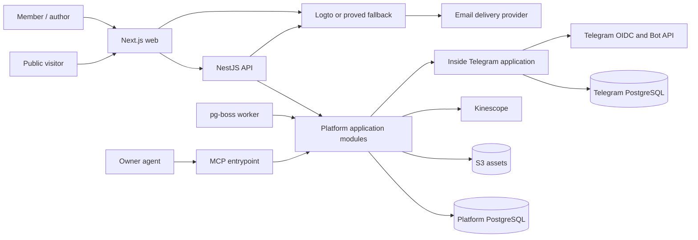
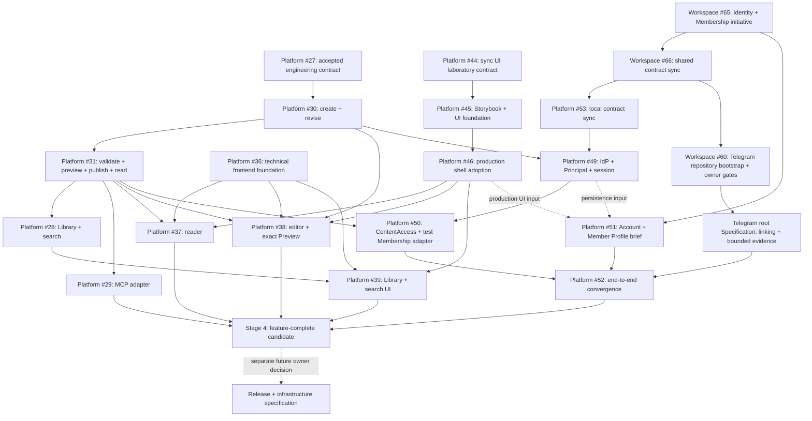

# Техническая спецификация Sachkov Inside Platform v1

Статус: accepted cross-repository specification из
[Workspace issue #40](https://github.com/sachkov-inside/workspace/issues/40). Live delivery state
принадлежит owning repository issues и Inside — Developer Pipeline, а отдельный
Identity/Membership track координирует
[Workspace initiative #65](https://github.com/sachkov-inside/workspace/issues/65).

Дата: 2026-08-24.

## 1. Результат и authority

Platform v1 становится каноническим домом материалов Inside: автор вручную создаёт и публикует
материалы, публичный посетитель находит и читает открытый контент, а участник связывает Platform
account с Telegram и получает закрытый контент, пока состоит в одном каноническом закрытом chat.

Эта спецификация фиксирует общую архитектуру, границы `platform` и будущего `inside-telegram`,
последовательность поставки и cross-repository зависимости. Она не является application ADR:

- продуктовый scope принадлежит каноническому
  [Platform MVP brief](https://github.com/sachkov-inside/platform/blob/main/docs/product/platform-mvp-brief.md);
- Platform implementation contract, код и ADR принадлежат `sachkov-inside/platform`;
- Telegram application contract, код и ADR будут принадлежать отдельному private repository после
  его bootstrap;
- Workspace хранит только общие продуктовые и cross-repository решения.

Ссылка на Platform brief задаёт human-facing authority, но не runtime или agent dependency:
подтверждённая cross-repository граница v1 полностью перечислена ниже и исполнима из Workspace.
Exact dependency versions, physical schema, package paths, deploy scripts и runbooks остаются только
в owning application repository.

При расхождении источников более позднее явное owner decision имеет приоритет, но owning document
должен быть синхронизирован до feature implementation. Сейчас канонический Platform brief всё ещё
говорит об автоматическом переносе Telegram-архива и обязательной material-specific discussion
link. Более поздний [аудит текущей публикации](../research/platform-current-publishing-audit.md)
подтверждает обратное: материалы создаются вручную без import/migration, а individual discussion
relation не входит в обязательный v1 scope. Первый Platform ticket устраняет это расхождение.

## 2. Scope и границы v1

### Входит

- публичные home, library, topic, series и editorial roadmap surfaces;
- индексируемые карточки всех опубликованных материалов и полное чтение free материалов;
- один закрытый Membership tier для bodies, assets, downloads и Kinescope video;
- email identity, private Platform Account, member-only Member Profile и явное связывание с одной
  Telegram identity;
- author admin с draft, preview, validation, revisions и owner-controlled publish;
- MCP поверх тех же application commands и правил, что admin и REST;
- PostgreSQL full-text search, metadata navigation и related materials;
- reading state `прочитано / не прочитано` и минимальная history;
- ручное создание актуальных материалов с опорой на Telegram как visual reference.

### Не входит

- billing, Tribute integration, тарифная матрица, trial, promo, gifts или продажа отдельных серий;
- Telegram roster import, Telegram content export/import и migration pipeline;
- bot messaging, announcements, campaigns, moderation/admin UI или marketing automation;
- anonymous/indexable internet-public profile, social graph, follows, direct messages или broad
  member directory до отдельного owner decision;
- comments/community внутри Platform и обязательная ссылка на discussion каждого Material;
- multi-author workflow, UGC, real-time collaboration, CRDT/Yjs;
- AI search, autonomous publish, delegated member access для MCP;
- Redis, отдельный search service, event bus или новые deployables без доказанного consumer;
- instant recall уже доставленных bytes или выданной video license;
- production environments, deployment, release/rollback, capacity, domains, monitoring, secrets,
  backup и recovery — они получат отдельную specification перед реальным release;
- final visual language, information design, typography, palette, motion и component/UI foundation
  вне owner-controlled lane Platform #44–#46; Storybook внутри существующего `apps/web` разрешён
  только как development laboratory, а не как отдельный production frontend.

Этапы ниже доводят v1 до feature-complete candidate в согласованной тестовой среде, но не объявляют
его released. Production delivery начинается только из отдельной owner-approved release and
infrastructure specification, созданной позже на основе измеренного application shape.

## 3. Канонические входы

Спецификация использует решения по ссылкам и не копирует их полные matrices/runbooks:

- [content authoring](../research/platform-content-authoring-model.md) — versioned ProseMirror JSON,
  Tiptap adapter, immutable revisions, safe renderer и semantic MCP commands как production
  baseline;
- [current publishing audit](../research/platform-current-publishing-audit.md) — Material-centered
  model, ручное создание, evolving taxonomy, ordered Platform build Series;
- [PostgreSQL data access](../research/platform-postgresql-data-access.md) — Kysely + `pg` и
  migrations-as-authority как production baseline;
- [identity](../research/platform-identity-architecture.md) — Logto OSS target, Better Auth fallback,
  Platform-owned authorization;
- [Telegram Membership](../research/platform-telegram-tribute-membership.md) — отдельная application,
  OIDC linking, `getChatMember` evidence и five-minute freshness;
- [Kinescope lifecycle](../research/platform-kinescope-video-lifecycle.md) — выбранный provider,
  local Video identity, reconciliation и strict authorization adapter;
- [ContentAccess](../research/platform-content-access.md) — единый provider-neutral policy module;
- [Identity and Membership contract](../contracts/identity-membership-v1.md) — shared authority
  matrix, versioned evidence envelope/reason codes, five-minute bound и conformance corpus для
  независимых Platform/Telegram implementations.

[Delivery and recovery research](../research/platform-delivery-recovery.md) остаётся evidence для
будущей отдельной specification. Его environments, release, observability и recovery choices не
являются scope или gate текущего delivery graph.

Общий словарь `Principal`, External identity, Platform Account/session, Member Profile, Membership
evidence/entitlement и `ContentAccess` находится в [`CONTEXT.md`](../../CONTEXT.md).

## 4. Cross-repository stack constraints

Platform уже bootstrapped как pnpm workspace. Следующие решения считаются принятыми и не требуют
повторного выбора в feature tickets:

| Concern | V1 contract |
|---|---|
| Runtime | Node.js 24 LTS; exact pin принадлежит Platform repository |
| Language/tooling | TypeScript strict и pnpm с exact lockfile |
| Web | Next.js App Router + React |
| Backend | NestJS + Fastify |
| Processes | `web`, `api`, `worker`, `mcp`; один backend codebase, отдельные thin entrypoint adapters |
| Contract | REST + OpenAPI; application rules не живут в controllers или transports |
| Transactional store | PostgreSQL 18; exact image pin принадлежит Platform repository |
| Data access | Kysely + `pg`, Kysely Migrator/`kysely-ctl`, generated DB types; один production path |
| Jobs | `pg-boss`; product queues создаются только вместе с первым durable job |
| Search | PostgreSQL FTS, ranking и bounded RU/EN normalization; без отдельного engine |
| Content document | versioned ProseMirror JSON + Tiptap adapter, immutable revisions, safe renderer и semantic commands |
| Assets | private/public object-storage seam; exact provider и operations выбираются позже |
| Video | Kinescope, существующие account и tariff; application adapter проходит credentialed proof |

Identity choice остаётся условным до отдельной application проверки и будущей operational
acceptance:

| Seam | Target | Fallback / no-go | Decision record |
|---|---|---|---|
| Identity | Logto OSS: email code, branded redirect, Next BFF, Nest JWT | Better Auth при failed application UX/protocol gate; operational acceptance остаётся в future infrastructure work | Platform ADR только после application и operational proofs |

Каждый implementing PR обновляет lockfile и фиксирует exact library versions. Platform #17/#18
сохраняют provenance ранней горизонтальной декомпозиции, а production data/document path задают
vertical capabilities #27–#31; #28 и #29 добавляют Library/search и MCP outcomes. Их dependency
order канонически задан в разделе 11, а live delivery state остаётся только в owning issues.
Public application interfaces из #30/#31 являются authority для всех последующих callers. Если
реализация обнаружит blocking limitation, owning PR фиксирует evidence и migration impact, после
чего меняется один production path; параллельные ORM/document/data paths не поддерживаются.

Technical frontend foundation из Platform
[#36](https://github.com/sachkov-inside/platform/issues/36) задаёт один `apps/web`, App Router/FSD
composition, backend connection seam и временный functional shell, который не является принятой
component system. Owner-controlled UI lane идёт параллельно headless/backend работе:
[#44](https://github.com/sachkov-inside/platform/issues/44) синхронизирует local contract,
[#45](https://github.com/sachkov-inside/platform/issues/45) создаёт
Storybook laboratory, bounded tokens/components и typed representative fixtures, а
[#46](https://github.com/sachkov-inside/platform/issues/46) применяет принятую foundation к
production shell. Laboratory — внутренний mergeable development surface, а не второй app или
deployable. Stories используют те же typed presentation contracts, что production adapters, но не
fake backend/client, business rules или второй production data path. Production routes #37–#39
соединяют approved UI только с реальными #30/#31/#28 interfaces.

Будущий `inside-telegram` начинает с TypeScript, Node.js 24 LTS, NestJS + Fastify, grammY,
PostgreSQL и Kysely + `pg` как production baseline. Platform и Telegram application не делят
database, source package или migration history.

## 5. System context и process boundaries

### Platform processes

| Process | Responsibility | Не владеет |
|---|---|---|
| `web` | SSR/RSC public/member/admin UI, BFF session, coarse access states | Membership rules, provider secrets, direct DB access |
| `api` | REST/OpenAPI adapters, auth mapping, uploads/callbacks и application commands | route-local domain policy |
| `worker` | durable projection, reconciliation и provider jobs | отдельная domain model или write path |
| `mcp` | authenticated MCP tools/resources поверх application interfaces | SQL, autonomous publish или borrowed browser Membership |

Process entrypoints используют одни application modules и могут проверяться отдельно. Их final
deployment topology остаётся вне этой specification; новые repositories/services не создаются до
появления реального distribution seam.

`inside-telegram` — отдельная application, потому что владеет Telegram credentials, OIDC linking и
Bot API calls. Platform вызывает её только через versioned, authenticated HTTP interface; tests
используют in-memory adapter того же port. Deployment shape обеих applications будет определён
позже.

Next.js process, App Router/FSD composition и application seams уже заданы technical foundation
#36. Visual/component foundation принадлежит #45 и попадает в production shell через #46; никакой
второй frontend application или route tree не создаётся.

## 6. Platform modules и seams

Modules ниже являются capability boundaries, а не обязательными npm packages. Внешний interface
каждого module остаётся малым; framework, SQL и provider types находятся в implementation или
adapter.

| Module | Interface responsibility | Основные owned facts |
|---|---|---|
| `IdentityPrincipals` | сопоставить trusted identity `(issuer, subject)` с local Principal и permissions | Principal, external identity mapping, account status |
| `ContentAuthoring` | создать/revise/validate/preview/publish/restore Material через optimistic commands | Material, draft/published pointers, revisions, author policy |
| `ContentSchema` | validate, migrate, safely render и extract projection из versioned document | schema versions, node/mark allowlist, fixture corpus |
| `ContentLibrary` | читать public/member projections, search, topic/series navigation и related materials | published projections и ranking rules |
| `ContentAccess` | `authorize(Subject, Resource, Action) -> AccessDecision` | provider-neutral access policy and reason codes |
| `MembershipEntitlements` | получить bounded evidence и построить Platform-owned entitlement | entitlement state/version/validity, refresh single-flight |
| `AccountProfiles` | управлять private Platform Account и отдельной member-visible Profile projection | account lifecycle, profile visibility/content/version |
| `Assets` | upload intent, finalize, revision binding и bounded delivery | Asset metadata, immutable object keys/renditions |
| `Videos` | Kinescope upload/status/reconcile/bind/playback lifecycle | local Video identity, provider mapping/status |
| `ReadingActivity` | idempotently mark read/unread и list bounded recent history | Principal-to-Material state; не даёт content access |

Seam rules:

- application use case владеет transaction boundary; все participating repositories получают один
  explicit transaction capability;
- HTTP, RSC, MCP и worker вызывают одинаковые use cases, а не параллельные rule sets;
- PostgreSQL проверяется real integration tests; in-memory repository не считается доказательством
  migrations, FTS, constraints или transaction semantics;
- Logto, S3 и Kinescope являются true external dependencies и получают narrow internal ports плюс
  test adapters;
- Telegram application является remote-but-owned dependency: Platform владеет port и entitlement
  logic, production HTTP adapter только переносит versioned evidence;
- generic multi-provider interfaces не создаются до второго реального adapter. Provider-neutral
  `ContentAccess` существует потому, что policy используется многими delivery callers, а не ради
  гипотетической смены S3/Kinescope.

## 7. Логическая content и access model

Physical tables, indexes и package paths уточняются в production implementation и local technical
spec; только действительно hard-to-reverse trade-off требует Platform ADR. V1 logical entities и
cardinalities являются частью этой спецификации:

| Entity | V1 cardinality и invariant |
|---|---|
| `Principal` | одна local identity; 0..1 Telegram link; roles/permissions Platform-owned |
| `ExternalIdentity` | trusted provider/issuer/subject mapping принадлежит ровно одному Principal; email не merge key |
| `PlatformAccount` | не более одного private account на human Principal; identity/security/linking state не публикуется |
| `MemberProfile` | 0..1 member-visible projection на human Principal; active members only; никогда не authorization input |
| `Material` | stable identity и slug; ровно один current draft pointer; 0..1 published pointer |
| `MaterialRevision` | immutable full snapshot; ровно один Material; versioned document, metadata и resource refs |
| `Topic` | Material имеет ровно один; одноуровневый managed dictionary |
| `Format` | Material имеет ровно один; описывает primary consumption mode, не Asset kind |
| `Tag` | Material имеет 0..N; managed dictionary с rename/merge без duplicate synonyms |
| `Series` | имеет 0..N ordered memberships; Material входит в 0..N Series |
| `SeriesMembership` | уникальная пара Series/Material и уникальная ordinal внутри Series |
| `Asset` | принадлежит Platform; revision ссылается на 0..N Assets; object key immutable |
| `Video` | local identity с одним Kinescope provider mapping; revision ссылается на 0..N Videos |
| `ExternalLink` | typed label + normalized URL; revision содержит 0..N links; URL не является entity identity |
| `NavigationPage` | editorial title/body + curated/query links; Roadmap использует эту роль |
| `MembershipEntitlement` | не более одного current `inside_membership` projection на Principal; always bounded |
| `ReadingState` | не более одной current state на Principal/Material; history bounded отдельной policy |

`MaterialRevision` хранит application-owned ProseMirror document с `schemaVersion`, stable block
`nodeId`, publishable metadata snapshot и local Asset/Video IDs. HTML, React tree, search text,
signed URLs, provider tokens и editor selection/history являются производными или ephemeral.

`Topic`, `Format`, `Tag` и `Series` создаются по мере ручного authoring. Candidate dictionaries из
аудита — fixtures для проверки модели, не seed ontology. Для v1 подтверждены только роли:

- «Создание Platform Inside» — ordered Series;
- Roadmap — `NavigationPage`;
- Library/material index — generated view, а не duplicated table;
- material-specific Telegram discussion relation отсутствует до отдельного owner decision.

Public `MaterialProjection` содержит title, summary/teaser, taxonomy, series и safe media metadata.
Он никогда не содержит closed body, private object locator или delivery credential. Published
body разрешается только через `publishedRevisionId`; draft resource нельзя получить через normal
read/download/play path.

## 8. Основные flows

### Authoring и publish

1. Admin или MCP отправляет application command с `materialId`, `baseRevisionId` и idempotency key.
2. `ContentAuthoring` нормализует IDs, проверяет permissions/references/limits через
   `ContentSchema` и сохраняет immutable revision в одной transaction.
3. Preview читает explicit revision и использует тот же safe renderer и `ContentAccess`, что
   published delivery.
4. Publish после explicit owner GO повторяет validation, atomically меняет published pointer,
   обновляет public/search projections и ставит только необходимые durable jobs.
5. Stale base возвращает `409`; MCP/admin не используют last-write-wins.

### Public и closed read

1. Public route читает только public projection; free body может быть shared-cacheable.
2. Closed route сначала получает Subject из trusted identity и вызывает `ContentAccess` до загрузки
   body в HTML/RSC payload.
3. Deny отображает public teaser/coarse state; allow загружает exact published revision.
4. Closed body, decision и credentials имеют `private, no-store`; shared cache и speculative
   protected prefetch запрещены.

### Sign-in, Account и Member Profile

1. Email IdP доказывает External identity; Platform сопоставляет trusted `(issuer, subject)` с
   одним Principal и создаёт finite Platform session. Email или IdP role не являются merge key,
   Membership или permission.
2. Human Principal управляет private Platform Account: identity/security, Telegram linking,
   Membership state и recovery. Service Principal не получает human Account/Profile/Membership.
3. Member Profile хранится и авторизуется отдельно от Account. Owner утверждает exact fields,
   avatar/moderation/discovery policy в Platform #51 до production implementation.
4. Только active member получает accepted Profile projection другого участника. Anonymous,
   non-member и crawler не получают projection; email, internal IDs, Telegram identity/evidence и
   security history никогда в неё не входят.

### Membership linking и refresh

1. Signed-in Principal создаёт short-lived link transaction через Platform.
2. Browser проходит Telegram OIDC через Telegram application; та проверяет token, uniqueness и
   configured chat membership.
3. Telegram application возвращает normalized, signed/authenticated evidence без raw Telegram
   model по [versioned contract](../contracts/identity-membership-v1.md). Platform строит собственный
   entitlement не позднее `validUntil` evidence.
4. Первый protected request после expiry делает single-flight refresh. Positive evidence живёт не
   более пяти минут; confirmed removal denies immediately; outage после expiry fails closed.

### Assets, downloads и video

1. `Assets` выдаёт author upload intent на random immutable key, finalize проверяет фактический
   type/size/checksum и только `ready` resource разрешает attach/publish.
2. Closed image/download сначала проходит `ContentAccess`; short-lived URL или stream bound to one
   Subject/Resource/Action и не живёт дольше access decision.
3. `Videos` создаёт Kinescope Tus upload server-side, принимает webhook только как hint и
   reconciles authoritative API state. Publish требует local `ready` Video.
4. Playback token и strict Kinescope callback повторно вызывают `ContentAccess`; любой mismatch,
   stale entitlement или outage возвращает deny.

### Search, navigation и related

- publish transaction обновляет search projection: title, summary, headings/body, asset labels и
  current metadata; closed body index остаётся server-side;
- PostgreSQL FTS ранжирует title выше summary/headings, затем taxonomy/body/assets; bounded RU/EN
  dictionary и audit fixtures проверяют typo/normalization cases;
- filters появляются только из реально используемых Topic/Format/Series values;
- related выдача сочетает metadata score и explicit author pins, не создавая AI dependency.

### MCP

- MCP аутентифицируется как отдельный service Principal с explicit author permissions;
- tools преобразуются в те же semantic commands, validation results и `409`, что admin;
- чтение/preview ресурсов вызывает `ContentAccess`; service Principal не наследует human
  Membership;
- `publish` технически доступен только как prepare/execute command с отдельным recorded owner GO;
  autonomous publish запрещён.

## 9. Нефункциональные требования

### Security и privacy

- все protected paths fail closed; ни identity, ни Telegram, ни Kinescope/S3 role не заменяют
  Platform authorization;
- cookie session: `Secure`, `HttpOnly`, explicit `SameSite`; mutations имеют CSRF + Origin checks;
- strict issuer/audience/expiry validation, short tokens, no secrets/tokens/raw sessions в logs;
- safe server renderer без raw HTML/MDX; allowlisted URLs/nodes, CSP и bounded document limits;
- closed bodies/objects физически или логически отделены от public projections/objects;
- private Platform Account и member-visible Profile имеют разные projections; email, provider
  claims, internal/Telegram IDs, evidence и security/audit state не публикуются;
- every protected allow/deny, preview и dependency failure получает safe correlation/audit facts
  через opaque local IDs; final telemetry pipeline определяется позже.

### SEO

- home, library, topic, series, Roadmap, public cards и free materials server-rendered с stable
  canonical URLs, metadata, sitemap и crawlable internal links;
- closed Material card может индексироваться, но closed body отсутствует в HTML, RSC, structured
  data, search endpoint и shared cache;
- draft/preview/admin/account/Member Profile/MCP surfaces имеют noindex и не входят в sitemap;
- publish/unpublish обновляет canonical projection и invalidates only affected public cache.

### Accessibility и responsive UI

- critical journeys работают keyboard-only с видимым focus, semantic headings/landmarks,
  accessible names и announced validation/errors;
- editor, tables, code, player, upload progress и paywall имеют non-pointer alternatives;
- mobile и desktop evidence обязательно для UI PR; automated audit не имеет serious/critical
  findings, а author/read/link/play journeys проходят manual keyboard + screen-reader smoke;
- reduced motion, text zoom и narrow viewport не скрывают content или controls.

### Performance

В repeatable agreed test environment с зафиксированным fixture corpus:

- public page server response p95 не выше 800 ms, protected non-video page p95 не выше 1.5 s без
  учёта user email/Telegram interaction;
- library search p95 не выше 300 ms при 10 000 Material projections и representative RU/EN set;
- public critical pages укладываются в LCP 2.5 s, INP 200 ms и CLS 0.1 на согласованном mobile
  profile;
- API/worker pool limits, query plans и payload/document limits измерены; Redis не добавляется как
  лечение непроверенного bottleneck.

Если profile или corpus делает budget нерепрезентативным, owner принимает новый measured budget до
UI implementation. Production SLO отдельно подтверждается будущей release/infrastructure
specification.

### Отложенные operational NFR

Environments, delivery, release/rollback, infrastructure capacity, secrets operations, telemetry,
alerts, backup/recovery и production SLO намеренно не определяются здесь. Они требуют отдельной
Workspace specification, когда Stage 4 даст реальный process/data/provider/capacity profile. До
этого текущие исследования не превращаются в deploy backlog или скрытый launch gate.

## 10. Вертикальные этапы

Этапы описывают capability delivery в repeatable local/CI/agreed integration environment. Они не
задают environments, deploy или production launch chronology. Headless/backend и UI laboratory
lanes развиваются параллельно; только production frontend integration ждёт результаты обоих.

### Stage 0 — contracts и technical foundations

Среда: clean CI/ephemeral Compose.

Результат:

- Platform [#27](https://github.com/sachkov-inside/platform/issues/27) задаёт engineering
  organization, module/interface map, validation и testing seams;
- Platform [#36](https://github.com/sachkov-inside/platform/issues/36) задаёт один production
  `apps/web`, App Router/FSD composition, backend connection seam, routes и accessible navigation;
- shell #36 остаётся функциональной visual заглушкой до #45/#46, а не reusable UI authority;
- #17/#18 и #20–#23/#40 сохраняются только как provenance и не входят в normative dependency graph.

Exit: следующие lanes используют contracts #27/#36 без второго backend/frontend foundation.

### Stage 1 — vertical headless/application delivery

Exact native dependencies для этого lane заданы в разделе 11.

Результат:

- #30 создаёт единственный retained create/load/revise path с PostgreSQL/Kysely,
  ProseMirror/Tiptap, immutable revisions и application interface;
- #31 поверх него поставляет validation, exact preview, recorded owner publish gate, atomic
  publish/unpublish/restore и safe public read;
- #28 и #29 используют те же ContentLibrary/ContentAuthoring/ContentSchema interfaces для
  поиска/navigation и thin MCP adapter;
- обязательные implementation briefs и explicit owner approvals #30/#31 сохраняются; frontend или
  transport не переопределяют их business rules, transactions и errors.

Exit: representative Material проходит create/revise/validate/exact preview/owner-approved
publish/read/unpublish/restore без semantic drift; draft/closed data не попадают в public
projection. RU/EN Library и MCP outcomes проверяются через те же production interfaces.

### Parallel UI lane — owner-controlled laboratory и shell adoption

Exact native dependencies для этого lane заданы в разделе 11. Он может выполняться параллельно
Stage 1, в отдельном worktree, и не блокирует headless/backend capabilities. При этом lanes не
реализуют одни production routes.

Результат:

- #44 синхронизирует repository-local documents и live frontend contracts;
- #45 создаёт development-only Storybook внутри существующего `apps/web`, semantic tokens,
  bounded components и representative stories на typed presentation contracts;
- fixtures покрывают нужные loading/empty/error/content/access/responsive states, но не реализуют
  fake API/client, business rules, SQL или alternate content model;
- #46 заменяет временную visual заглушку shell #36 на owner-approved tokens/components; production
  bundle не включает Storybook runtime или fixtures;
- exact initial brief, rendered mobile/desktop evidence, visual/component GO и merge GO остаются
  owner gates #45/#46. Broad speculative catalog и отдельное frontend application запрещены.

Exit: один production shell использует принятую foundation; stories и production adapters могут
передать одинаковые presentation props, но только adapters получают данные из real application
interfaces.

### Stage 2 — production frontend integration

Production routes соединяют результаты Stage 1 и UI lane без второй реализации components или
data path. Exact integration dependencies заданы только в разделе 11:

- [#37](https://github.com/sachkov-inside/platform/issues/37) применяет safe read outcome к
  Material reader;
- [#38](https://github.com/sachkov-inside/platform/issues/38) применяет create/revise/lifecycle
  outcomes к author editor и exact Preview;
- [#39](https://github.com/sachkov-inside/platform/issues/39) применяет ContentLibrary outcome к
  Library/search/Topic/Series surfaces.

Server/application adapters маппят реальные #30/#31/#28 outcomes в принятые presentation
contracts; Storybook fixtures не импортируются в runtime routes. Каждый surface сохраняет
mobile/desktop visual, accessibility и merge owner gates.

Exit: reader, editor/Preview и Library/search работают в одном `apps/web`, используют canonical
application interfaces и approved UI foundation; closed content, validation/conflicts и search
semantics не дублируются в browser code.

### Parallel Identity/Membership track — независимые consumer/provider lanes

Этот track начинается после принятия
[Workspace #65](https://github.com/sachkov-inside/workspace/issues/65) и
[versioned contract](../contracts/identity-membership-v1.md); он не ждёт завершения Stage 2.
Конкретные integration points сохраняют native dependencies на реально потребляемые content/UI
capabilities.

Platform consumer lane:

- [#53](https://github.com/sachkov-inside/platform/issues/53) синхронизирует repository-local
  identity/account/profile contract после Workspace #66;
- [#49](https://github.com/sachkov-inside/platform/issues/49) после #30/#53 доказывает IdP flow и
  поставляет External identity → Principal → Platform session foundation параллельно #31/UI lane;
- [#50](https://github.com/sachkov-inside/platform/issues/50) после #49/#31 проводит реальные
  protected resources через `ContentAccess` и bounded test Membership adapter;
- [#51](https://github.com/sachkov-inside/platform/issues/51) может начать owner Profile brief
  сразу; persistence ждёт #49, а production UI — принятую #46 foundation.

Telegram provider lane:

- [Workspace #60](https://github.com/sachkov-inside/workspace/issues/60) после accepted contract
  slice и explicit repository/operator confirmations создаёт private repository, harness, root
  Specification и первый production ticket; завершённый Platform #50 не является trigger;
- Telegram application независимо реализует OIDC linking, uniqueness/recovery и read-only
  `getChatMember` evidence и проходит provider-side corpus того же contract;
- applications не делят database, source package или migration history и vendor-ят versioned test
  snapshot вместо runtime dependency на Workspace/соседний checkout.

Exit: Platform consumer/test adapter и Telegram provider отдельно проходят normative conformance
corpus. Ни один результат ещё не объявляет production enablement или credential rollout.

### Stage 3 — end-to-end Identity и Membership convergence

[Platform #52](https://github.com/sachkov-inside/platform/issues/52) соединяет независимо готовые
consumer/provider implementations через authenticated versioned HTTP adapter. Link, member,
non-member, removal, expiry, rejoin, replay, duplicate identity, contract mismatch и outage проходят
end-to-end; Account показывает точные linking/Membership states, а `ContentAccess` остаётся final
authority для page/REST/MCP/resource paths.

Exit: anonymous/authenticated/active/expired/author/admin, cross-Subject cache leak и dependency
outage cases зелёные; positive entitlement не переживает evidence/five-minute bound. IdP и Telegram
integration объявлены application-ready в agreed temporary environment, но не production-ready.

### Stage 4 — feature-complete v1 candidate

Результат: author/MCP управляют полным v1 document set, private assets/downloads и Kinescope upload
-> process -> preview -> publish -> play; member читает, скачивает, смотрит и получает read state /
recent history. Актуальные материалы вручную пересозданы без import pipeline; real taxonomy
определяет действительно нужные filters/synonyms.

Exit: все v1 journeys и negative cases зелёные в agreed test environment, включая strict Kinescope
callback, private delivery, cross-revision mismatch, provider outage, MCP `409`/idempotency,
reading state и UI evidence. Это feature-complete candidate, не released product.

### После Stage 4 — отдельная release and infrastructure specification

Только тогда создаётся новая Workspace specification для environments, domains/callbacks,
capacity, deployment/promotion/rollback, observability/alerts, secrets, provider operations,
backup/recovery, RPO/RTO и production GO. Её решения опираются на измеренный Stage 4 profile, а не
  на предположения до измерений. Эта specification не создаёт release backlog заранее.

## 11. Dependency graph

Graph отражает три параллельных delivery lane: content/application, owner-controlled UI и
Identity/Membership consumer/provider. #45 не ждёт backend identity; #51 может начать owner brief до
#49/#46, но production persistence/UI используют их принятые contracts. Telegram bootstrap #60
ждёт только accepted Workspace contract slice и explicit repository/operator gates, не готовый #50.
Platform/Telegram сходятся впервые в #52 после независимых conformance tests. Release/infrastructure
work не является текущей downstream ticket: оно получает новую specification только из измеренного
Stage 4 candidate.

## 12. Owner decision gates и ADR inputs

| Decision | Нужна к этапу | Default/recommendation | Если не принято |
|---|---|---|---|
| #45 Storybook/reference/component/token brief и visual/component GO | UI laboratory | bounded set из representative compositions на typed presentation contracts | UI adoption/integration blocked; backend не blocked |
| #46 rendered shell adoption | production frontend shell | заменить visual заглушку #36 без Storybook runtime/fixtures | Stage 2 integration blocked; backend не blocked |
| Rendered surfaces #37–#39 | Stage 2 integration | approved components + real application interfaces | reuse следующими surfaces blocked |
| Identity UX: email code/password, redirect/inline, Yandex и OIDC/M2M horizon | Platform #49 proof | начать с branded redirect + email code; Better Auth fallback | #49 production code blocked |
| Identity link/unlink/recovery authority | Platform #49/#52 | explicit verification; audited owner recovery без email-only merge | linking/convergence blocked |
| Member Profile fields, avatar/moderation и discovery | Platform #51 brief | member-only, noindex, separate private Account; exact fields owner-approved | #51 production code blocked |
| Repository name `inside-telegram` и private visibility | Workspace #60 bootstrap | confirm current working name | repository creation blocked |
| Bot username/name/avatar/recovery owner и exceptional relink policy | Telegram provider proof | one recoverable Inside owner; no self-service replacement | credentialed proof blocked |
| Kinescope strict callback mechanics и acceptable continued-play window | Stage 4 | strict fail-closed; measure current plan | video remains unavailable |

Hard-to-reverse Platform ADR inputs only when production implementation reveals a real trade-off:

- data authority, migration runner и transaction seam;
- canonical document schema, revision model, safe renderer и MCP commands;
- identity provider/BFF/token mapping после application и future operational proofs;
- `ContentAccess` placement and conformance surface;
- private Asset delivery mechanism;
- Kinescope upload/reconciliation/strict authorization mechanics;
- UI component/primitives strategy только если #45 implementation выявит hard-to-reverse trade-off.

`inside-telegram` ADR inputs after bootstrap/proof:

- OIDC linking, identity uniqueness/recovery and exact validation policy;
- Membership evidence interface, five-minute validity and outage semantics;
- grammY/Nest/PostgreSQL adapters and credential ownership.

No ADR is created in Workspace for these application implementation choices. Future
release/infrastructure specification отдельно решит environments, capacity, domains/callbacks,
deployment/rollback, provider operations, secrets, observability, backup/recovery и production GO.
