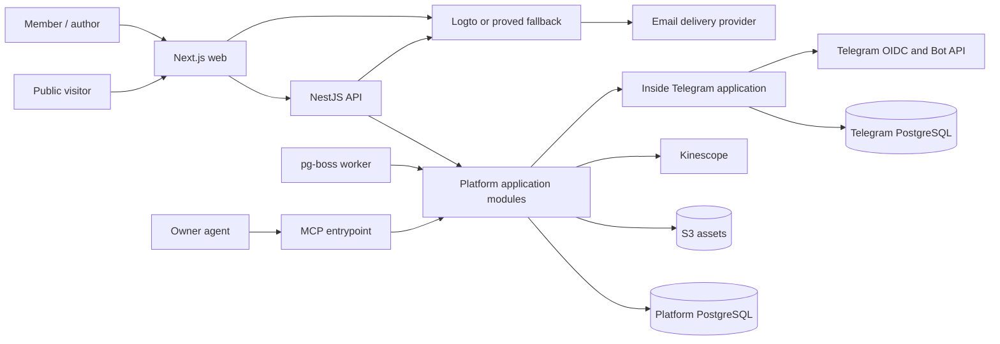
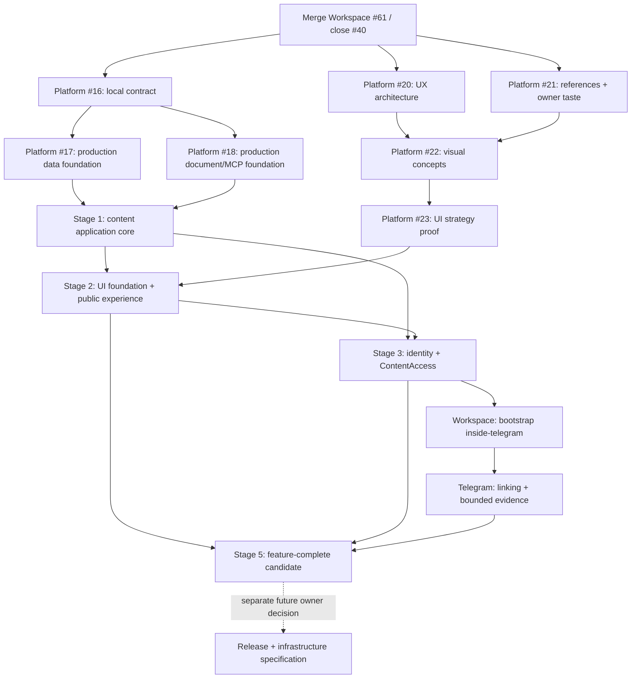

# Техническая спецификация Sachkov Inside Platform v1

Статус: proposed cross-repository specification для
[Workspace issue #40](https://github.com/sachkov-inside/workspace/issues/40).

Дата: 2026-08-21.

## 1. Результат и authority

Platform v1 становится каноническим домом материалов Inside: автор вручную создаёт и публикует
материалы, публичный посетитель находит и читает открытый контент, а участник связывает Platform
account с Telegram и получает закрытый контент, пока состоит в одном каноническом закрытом chat.

Эта спецификация фиксирует общую архитектуру, границы `platform` и будущего `inside-telegram`,
последовательность поставки и cross-repository зависимости. Она не является application ADR:

- продуктовый scope принадлежит каноническому
  [Platform MVP brief](https://github.com/sachkov-inside/platform/blob/main/docs/product/platform-mvp-brief.md);
- Platform implementation contract, код и ADR принадлежат `sachkov-inside/platform`;
- Telegram application contract, код и ADR будут принадлежать отдельному private repository после
  его bootstrap;
- Workspace хранит только общие продуктовые и cross-repository решения.

Ссылка на Platform brief задаёт human-facing authority, но не runtime или agent dependency:
подтверждённая cross-repository граница v1 полностью перечислена ниже и исполнима из Workspace.
Exact dependency versions, physical schema, package paths, deploy scripts и runbooks остаются только
в owning application repository.

При расхождении источников более позднее явное owner decision имеет приоритет, но owning document
должен быть синхронизирован до feature implementation. Сейчас канонический Platform brief всё ещё
говорит об автоматическом переносе Telegram-архива и обязательной material-specific discussion
link. Более поздний [аудит текущей публикации](../research/platform-current-publishing-audit.md)
подтверждает обратное: материалы создаются вручную без import/migration, а individual discussion
relation не входит в обязательный v1 scope. Первый Platform ticket устраняет это расхождение.

## 2. Scope и границы v1

### Входит

- публичные home, library, topic, series и editorial roadmap surfaces;
- индексируемые карточки всех опубликованных материалов и полное чтение free материалов;
- один закрытый Membership tier для bodies, assets, downloads и Kinescope video;
- email identity, Platform account и явное связывание с одной Telegram identity;
- author admin с draft, preview, validation, revisions и owner-controlled publish;
- MCP поверх тех же application commands и правил, что admin и REST;
- PostgreSQL full-text search, metadata navigation и related materials;
- reading state `прочитано / не прочитано` и минимальная history;
- ручное создание актуальных материалов с опорой на Telegram как visual reference.

### Не входит

- billing, Tribute integration, тарифная матрица, trial, promo, gifts или продажа отдельных серий;
- Telegram roster import, Telegram content export/import и migration pipeline;
- bot messaging, announcements, campaigns, moderation/admin UI или marketing automation;
- comments/community внутри Platform и обязательная ссылка на discussion каждого Material;
- multi-author workflow, UGC, real-time collaboration, CRDT/Yjs;
- AI search, autonomous publish, delegated member access для MCP;
- Redis, отдельный search service, event bus или новые deployables без доказанного consumer;
- instant recall уже доставленных bytes или выданной video license;
- production environments, deployment, release/rollback, capacity, domains, monitoring, secrets,
  backup и recovery — они получат отдельную specification перед реальным release;
- final visual language, information design, typography, palette, motion и component/UI library —
  их до frontend implementation проектирует отдельная
  [Platform specification #19](https://github.com/sachkov-inside/platform/issues/19).

Этапы ниже доводят v1 до feature-complete candidate в согласованной тестовой среде, но не объявляют
его released. Production delivery начинается только из отдельной owner-approved release and
infrastructure specification, созданной позже на основе измеренного application shape.

## 3. Канонические входы

Спецификация использует решения по ссылкам и не копирует их полные matrices/runbooks:

- [content authoring](../research/platform-content-authoring-model.md) — versioned ProseMirror JSON,
  Tiptap adapter, immutable revisions, safe renderer и semantic MCP commands как production
  baseline;
- [current publishing audit](../research/platform-current-publishing-audit.md) — Material-centered
  model, ручное создание, evolving taxonomy, ordered Platform build Series;
- [PostgreSQL data access](../research/platform-postgresql-data-access.md) — Kysely + `pg` и
  migrations-as-authority как production baseline;
- [identity](../research/platform-identity-architecture.md) — Logto OSS target, Better Auth fallback,
  Platform-owned authorization;
- [Telegram Membership](../research/platform-telegram-tribute-membership.md) — отдельная application,
  OIDC linking, `getChatMember` evidence и five-minute freshness;
- [Kinescope lifecycle](../research/platform-kinescope-video-lifecycle.md) — выбранный provider,
  local Video identity, reconciliation и strict authorization adapter;
- [ContentAccess](../research/platform-content-access.md) — единый provider-neutral policy module.

[Delivery and recovery research](../research/platform-delivery-recovery.md) остаётся evidence для
будущей отдельной specification. Его environments, release, observability и recovery choices не
являются scope или gate текущего delivery graph.

Общий словарь `Principal`, Membership evidence/entitlement и `ContentAccess` находится в
[`CONTEXT.md`](../../CONTEXT.md).

## 4. Cross-repository stack constraints

Platform уже bootstrapped как pnpm workspace. Следующие решения считаются принятыми и не требуют
повторного выбора в feature tickets:

| Concern | V1 contract |
|---|---|
| Runtime | Node.js 24 LTS; exact pin принадлежит Platform repository |
| Language/tooling | TypeScript strict и pnpm с exact lockfile |
| Web | Next.js App Router + React |
| Backend | NestJS + Fastify |
| Processes | `web`, `api`, `worker`, `mcp`; один backend codebase, отдельные thin entrypoint adapters |
| Contract | REST + OpenAPI; application rules не живут в controllers или transports |
| Transactional store | PostgreSQL 18; exact image pin принадлежит Platform repository |
| Data access | Kysely + `pg`, Kysely Migrator/`kysely-ctl`, generated DB types; один production path |
| Jobs | `pg-boss`; product queues создаются только вместе с первым durable job |
| Search | PostgreSQL FTS, ranking и bounded RU/EN normalization; без отдельного engine |
| Content document | versioned ProseMirror JSON + Tiptap adapter, immutable revisions, safe renderer и semantic commands |
| Assets | private/public object-storage seam; exact provider и operations выбираются позже |
| Video | Kinescope, существующие account и tariff; application adapter проходит credentialed proof |

Identity choice остаётся условным до отдельной application проверки и будущей operational
acceptance:

| Seam | Target | Fallback / no-go | Decision record |
|---|---|---|---|
| Identity | Logto OSS: email code, branded redirect, Next BFF, Nest JWT | Better Auth при failed application UX/protocol gate; operational acceptance остаётся в future infrastructure work | Platform ADR только после application и operational proofs |

Каждый implementing PR обновляет lockfile и фиксирует exact library versions. Kysely/PostgreSQL и
ProseMirror/Tiptap не получают отдельные throwaway prototypes или comparison gates: Platform #17 и
#18 сразу поставляют production modules и их обычные integration tests. Если реальная реализация
обнаружит blocking limitation, owning PR фиксирует evidence и migration impact, после чего stack
меняется одним production path; параллельные ORM/document stacks не поддерживаются.

Visual stack намеренно не выбран здесь. Platform #19 сначала фиксирует UX structure и owner taste,
сравнивает rendered concepts, а затем доказывает component/primitives strategy на принятом
направлении. Production frontend feature code не начинается до этого UI gate.

Будущий `inside-telegram` начинает с TypeScript, Node.js 24 LTS, NestJS + Fastify, grammY,
PostgreSQL и Kysely + `pg` как production baseline. Platform и Telegram application не делят
database, source package или migration history.

## 5. System context и process boundaries

### Platform processes

| Process | Responsibility | Не владеет |
|---|---|---|
| `web` | SSR/RSC public/member/admin UI, BFF session, coarse access states | Membership rules, provider secrets, direct DB access |
| `api` | REST/OpenAPI adapters, auth mapping, uploads/callbacks и application commands | route-local domain policy |
| `worker` | durable projection, reconciliation и provider jobs | отдельная domain model или write path |
| `mcp` | authenticated MCP tools/resources поверх application interfaces | SQL, autonomous publish или borrowed browser Membership |

Process entrypoints используют одни application modules и могут проверяться отдельно. Их final
deployment topology остаётся вне этой specification; новые repositories/services не создаются до
появления реального distribution seam.

`inside-telegram` — отдельная application, потому что владеет Telegram credentials, OIDC linking и
Bot API calls. Platform вызывает её только через versioned, authenticated HTTP interface; tests
используют in-memory adapter того же port. Deployment shape обеих applications будет определён
позже.

Next.js process и его application seams являются техническим baseline, но visual structure и UI
foundation принадлежат Platform #19.

## 6. Platform modules и seams

Modules ниже являются capability boundaries, а не обязательными npm packages. Внешний interface
каждого module остаётся малым; framework, SQL и provider types находятся в implementation или
adapter.

| Module | Interface responsibility | Основные owned facts |
|---|---|---|
| `IdentityPrincipals` | сопоставить trusted identity `(issuer, subject)` с local Principal и permissions | Principal, external identity mapping, account status |
| `ContentAuthoring` | создать/revise/validate/preview/publish/restore Material через optimistic commands | Material, draft/published pointers, revisions, author policy |
| `ContentSchema` | validate, migrate, safely render и extract projection из versioned document | schema versions, node/mark allowlist, fixture corpus |
| `ContentLibrary` | читать public/member projections, search, topic/series navigation и related materials | published projections и ranking rules |
| `ContentAccess` | `authorize(Subject, Resource, Action) -> AccessDecision` | provider-neutral access policy and reason codes |
| `MembershipEntitlements` | получить bounded evidence и построить Platform-owned entitlement | entitlement state/version/validity, refresh single-flight |
| `Assets` | upload intent, finalize, revision binding и bounded delivery | Asset metadata, immutable object keys/renditions |
| `Videos` | Kinescope upload/status/reconcile/bind/playback lifecycle | local Video identity, provider mapping/status |
| `ReadingActivity` | idempotently mark read/unread и list bounded recent history | Principal-to-Material state; не даёт content access |

Seam rules:

- application use case владеет transaction boundary; все participating repositories получают один
  explicit transaction capability;
- HTTP, RSC, MCP и worker вызывают одинаковые use cases, а не параллельные rule sets;
- PostgreSQL проверяется real integration tests; in-memory repository не считается доказательством
  migrations, FTS, constraints или transaction semantics;
- Logto, S3 и Kinescope являются true external dependencies и получают narrow internal ports плюс
  test adapters;
- Telegram application является remote-but-owned dependency: Platform владеет port и entitlement
  logic, production HTTP adapter только переносит versioned evidence;
- generic multi-provider interfaces не создаются до второго реального adapter. Provider-neutral
  `ContentAccess` существует потому, что policy используется многими delivery callers, а не ради
  гипотетической смены S3/Kinescope.

## 7. Логическая content и access model

Physical tables, indexes и package paths уточняются в production implementation и local technical
spec; только действительно hard-to-reverse trade-off требует Platform ADR. V1 logical entities и
cardinalities являются частью этой спецификации:

| Entity | V1 cardinality и invariant |
|---|---|
| `Principal` | одна local identity; 0..1 Telegram link; roles/permissions Platform-owned |
| `Material` | stable identity и slug; ровно один current draft pointer; 0..1 published pointer |
| `MaterialRevision` | immutable full snapshot; ровно один Material; versioned document, metadata и resource refs |
| `Topic` | Material имеет ровно один; одноуровневый managed dictionary |
| `Format` | Material имеет ровно один; описывает primary consumption mode, не Asset kind |
| `Tag` | Material имеет 0..N; managed dictionary с rename/merge без duplicate synonyms |
| `Series` | имеет 0..N ordered memberships; Material входит в 0..N Series |
| `SeriesMembership` | уникальная пара Series/Material и уникальная ordinal внутри Series |
| `Asset` | принадлежит Platform; revision ссылается на 0..N Assets; object key immutable |
| `Video` | local identity с одним Kinescope provider mapping; revision ссылается на 0..N Videos |
| `ExternalLink` | typed label + normalized URL; revision содержит 0..N links; URL не является entity identity |
| `NavigationPage` | editorial title/body + curated/query links; Roadmap использует эту роль |
| `MembershipEntitlement` | не более одного current `inside_membership` projection на Principal; always bounded |
| `ReadingState` | не более одной current state на Principal/Material; history bounded отдельной policy |

`MaterialRevision` хранит application-owned ProseMirror document с `schemaVersion`, stable block
`nodeId`, publishable metadata snapshot и local Asset/Video IDs. HTML, React tree, search text,
signed URLs, provider tokens и editor selection/history являются производными или ephemeral.

`Topic`, `Format`, `Tag` и `Series` создаются по мере ручного authoring. Candidate dictionaries из
аудита — fixtures для проверки модели, не seed ontology. Для v1 подтверждены только роли:

- «Создание Platform Inside» — ordered Series;
- Roadmap — `NavigationPage`;
- Library/material index — generated view, а не duplicated table;
- material-specific Telegram discussion relation отсутствует до отдельного owner decision.

Public `MaterialProjection` содержит title, summary/teaser, taxonomy, series и safe media metadata.
Он никогда не содержит closed body, private object locator или delivery credential. Published
body разрешается только через `publishedRevisionId`; draft resource нельзя получить через normal
read/download/play path.

## 8. Основные flows

### Authoring и publish

1. Admin или MCP отправляет application command с `materialId`, `baseRevisionId` и idempotency key.
2. `ContentAuthoring` нормализует IDs, проверяет permissions/references/limits через
   `ContentSchema` и сохраняет immutable revision в одной transaction.
3. Preview читает explicit revision и использует тот же safe renderer и `ContentAccess`, что
   published delivery.
4. Publish после explicit owner GO повторяет validation, atomically меняет published pointer,
   обновляет public/search projections и ставит только необходимые durable jobs.
5. Stale base возвращает `409`; MCP/admin не используют last-write-wins.

### Public и closed read

1. Public route читает только public projection; free body может быть shared-cacheable.
2. Closed route сначала получает Subject из trusted identity и вызывает `ContentAccess` до загрузки
   body в HTML/RSC payload.
3. Deny отображает public teaser/coarse state; allow загружает exact published revision.
4. Closed body, decision и credentials имеют `private, no-store`; shared cache и speculative
   protected prefetch запрещены.

### Membership linking и refresh

1. Signed-in Principal создаёт short-lived link transaction через Platform.
2. Browser проходит Telegram OIDC через Telegram application; та проверяет token, uniqueness и
   configured chat membership.
3. Telegram application возвращает normalized, signed/authenticated evidence без raw Telegram
   model. Platform строит собственный entitlement не позднее `validUntil` evidence.
4. Первый protected request после expiry делает single-flight refresh. Positive evidence живёт не
   более пяти минут; confirmed removal denies immediately; outage после expiry fails closed.

### Assets, downloads и video

1. `Assets` выдаёт author upload intent на random immutable key, finalize проверяет фактический
   type/size/checksum и только `ready` resource разрешает attach/publish.
2. Closed image/download сначала проходит `ContentAccess`; short-lived URL или stream bound to one
   Subject/Resource/Action и не живёт дольше access decision.
3. `Videos` создаёт Kinescope Tus upload server-side, принимает webhook только как hint и
   reconciles authoritative API state. Publish требует local `ready` Video.
4. Playback token и strict Kinescope callback повторно вызывают `ContentAccess`; любой mismatch,
   stale entitlement или outage возвращает deny.

### Search, navigation и related

- publish transaction обновляет search projection: title, summary, headings/body, asset labels и
  current metadata; closed body index остаётся server-side;
- PostgreSQL FTS ранжирует title выше summary/headings, затем taxonomy/body/assets; bounded RU/EN
  dictionary и audit fixtures проверяют typo/normalization cases;
- filters появляются только из реально используемых Topic/Format/Series values;
- related выдача сочетает metadata score и explicit author pins, не создавая AI dependency.

### MCP

- MCP аутентифицируется как отдельный service Principal с explicit author permissions;
- tools преобразуются в те же semantic commands, validation results и `409`, что admin;
- чтение/preview ресурсов вызывает `ContentAccess`; service Principal не наследует human
  Membership;
- `publish` технически доступен только как prepare/execute command с отдельным recorded owner GO;
  autonomous publish запрещён.

## 9. Нефункциональные требования

### Security и privacy

- все protected paths fail closed; ни identity, ни Telegram, ни Kinescope/S3 role не заменяют
  Platform authorization;
- cookie session: `Secure`, `HttpOnly`, explicit `SameSite`; mutations имеют CSRF + Origin checks;
- strict issuer/audience/expiry validation, short tokens, no secrets/tokens/raw sessions в logs;
- safe server renderer без raw HTML/MDX; allowlisted URLs/nodes, CSP и bounded document limits;
- closed bodies/objects физически или логически отделены от public projections/objects;
- every protected allow/deny, preview и dependency failure получает safe correlation/audit facts
  через opaque local IDs; final telemetry pipeline определяется позже.

### SEO

- home, library, topic, series, Roadmap, public cards и free materials server-rendered с stable
  canonical URLs, metadata, sitemap и crawlable internal links;
- closed Material card может индексироваться, но closed body отсутствует в HTML, RSC, structured
  data, search endpoint и shared cache;
- draft/preview/admin/account/MCP surfaces имеют noindex и не входят в sitemap;
- publish/unpublish обновляет canonical projection и invalidates only affected public cache.

### Accessibility и responsive UI

- critical journeys работают keyboard-only с видимым focus, semantic headings/landmarks,
  accessible names и announced validation/errors;
- editor, tables, code, player, upload progress и paywall имеют non-pointer alternatives;
- mobile и desktop evidence обязательно для UI PR; automated audit не имеет serious/critical
  findings, а author/read/link/play journeys проходят manual keyboard + screen-reader smoke;
- reduced motion, text zoom и narrow viewport не скрывают content или controls.

### Performance

В repeatable agreed test environment с зафиксированным fixture corpus:

- public page server response p95 не выше 800 ms, protected non-video page p95 не выше 1.5 s без
  учёта user email/Telegram interaction;
- library search p95 не выше 300 ms при 10 000 Material projections и representative RU/EN set;
- public critical pages укладываются в LCP 2.5 s, INP 200 ms и CLS 0.1 на согласованном mobile
  profile;
- API/worker pool limits, query plans и payload/document limits измерены; Redis не добавляется как
  лечение непроверенного bottleneck.

Если profile или corpus делает budget нерепрезентативным, owner принимает новый measured budget до
UI implementation. Production SLO отдельно подтверждается будущей release/infrastructure
specification.

### Отложенные operational NFR

Environments, delivery, release/rollback, infrastructure capacity, secrets operations, telemetry,
alerts, backup/recovery и production SLO намеренно не определяются здесь. Они требуют отдельной
Workspace specification, когда Stage 5 даст реальный process/data/provider/capacity profile. До
этого текущие исследования не превращаются в deploy backlog или скрытый launch gate.

## 10. Вертикальные этапы

Этапы описывают capability delivery в repeatable local/CI/agreed integration environment. Они не
задают environments, deploy или production launch chronology. UI design track идёт параллельно
application core и блокирует только production frontend implementation.

### Stage 0 — синхронизировать contract и реализовать headless production foundations

Среда: clean CI/ephemeral Compose.

Результат:

- Platform brief и local technical docs отражают принятые no-import/discussion/access decisions;
- Platform #17 поставляет production PostgreSQL/Kysely migrations, data module, publish transaction
  и FTS path;
- Platform #18 поставляет production ProseMirror/Tiptap document module, revisions, safe renderer,
  schema migration и semantic MCP commands;
- Platform #19–#23 фиксируют отдельный UX/visual/UI foundation track до frontend feature code;
- focused integration tests проверяют production contracts в owning repository; отдельного
  prototype codebase или кода на выброс нет;
- Platform ADR создаётся только если production implementation выявляет реальный
  hard-to-reverse trade-off.

Exit: production data/document foundations merged и используются последующим content core.
Identity provider остаётся provisional до отдельной application проверки и будущего operational
acceptance; его нельзя объявлять production-ready внутри Stage 0.

### Stage 1 — content application core без visual frontend

Результат: author/MCP/API use cases создают, меняют, validate, preview и publish representative
Material; transaction, immutable revisions, public/search projections и semantic conflicts
проверяются через application interfaces. Minimal test harness может показывать rendered output,
но не становится visual direction или production UI.

Exit: sanitized Material проходит edit/save/reload/publish/unpublish/restore без semantic drift;
draft не виден public projection; RU/EN search fixtures и transaction cases зелёные.

### UI Gate — спроектировать интерфейс до feature implementation

Platform [#19](https://github.com/sachkov-inside/platform/issues/19) владеет отдельной
specification:

- [#20](https://github.com/sachkov-inside/platform/issues/20) фиксирует UX architecture, states,
  real content fixtures и low-fidelity responsive wireframes;
- [#21](https://github.com/sachkov-inside/platform/issues/21) собирает annotated references,
  anti-references и owner taste/preferences;
- [#22](https://github.com/sachkov-inside/platform/issues/22) сравнивает 2–3 genuinely different
  visual concepts на одинаковых real surfaces и получает explicit owner selection;
- [#23](https://github.com/sachkov-inside/platform/issues/23) после выбора доказывает current
  component/primitives strategy, semantic tokens и agent-friendly UI contract.

Exit: выбран direction, доказан bounded foundation и создан отдельный implementation ticket на
один reference surface. До этого нельзя выбирать broad component library, строить full UI catalog
или писать production feature UI.

### Stage 2 — UI foundation и public experience

Dependencies: Stage 1 application contracts и закрытый UI Gate.

Результат: accepted direction реализован через bounded tokens/primitives на первом reference
surface, затем применяется к home, Library, Topic, Series, Roadmap и free Material. Author работает
с минимальным accepted admin/editor surface, а не throwaway styling.

Exit: real content и states проходят mobile/desktop visual evidence, keyboard/screen-reader smoke,
SEO и performance budgets; generated views не дублируют data, taxonomy появляется только вместе с
content, ad-hoc styles не обходят UI foundation.

### Stage 3 — identity и provider-neutral protected content

Результат: visitor создаёт email account, BFF session maps to Principal, а `ContentAccess` защищает
closed body/asset/download/video interfaces через один conformance matrix. До Telegram integration
Membership port использует только bounded test adapter. Identity application proof проверяет UX,
BFF/token protocol и fallback; self-host capacity, operations и release acceptance остаются future
infrastructure work.

Exit: anonymous/authenticated/active/expired/author/admin, two-Subject cache leak и dependency
outage cases зелёные для page/REST/MCP/resource paths; provider объявлен только application-ready,
не production-ready.

### Stage 4 — bootstrap `inside-telegram` и включить real Membership

Trigger: Stage 3 стабилизировал versioned evidence port и Platform can consume it through HTTP and
in-memory adapters. До trigger не создаются bot messaging/admin/campaign packages или deployables.

Результат:

- Workspace bootstrap ticket создаёт подтверждённый private repository с собственным harness,
  repository contract, CI и testable application scaffold;
- Telegram application реализует OIDC link, uniqueness/recovery invariants, read-only
  `getChatMember` evidence и authenticated internal interface;
- Platform сохраняет bounded entitlement и прекращает новые protected operations не позднее пяти
  минут после confirmed removal/evidence expiry.

Exit: existing member, non-member, removal, rejoin, replay, duplicate identity, lost admin/token и
outage проходят credentialed proof в согласованной temporary/integration environment. Production
enablement не входит в этот gate.

### Stage 5 — feature-complete v1 candidate

Результат: author/MCP управляют полным v1 document set, private assets/downloads и Kinescope upload
-> process -> preview -> publish -> play; member читает, скачивает, смотрит и получает read state /
recent history. Актуальные материалы вручную пересозданы без import pipeline; real taxonomy
определяет действительно нужные filters/synonyms.

Exit: все v1 journeys и negative cases зелёные в agreed test environment, включая strict Kinescope
callback, private delivery, cross-revision mismatch, provider outage, MCP `409`/idempotency,
reading state и UI evidence. Это feature-complete candidate, не released product.

### После Stage 5 — отдельная release and infrastructure specification

Только тогда создаётся новая Workspace specification для environments, domains/callbacks,
capacity, deployment/promotion/rollback, observability/alerts, secrets, provider operations,
backup/recovery, RPO/RTO и production GO. Её решения опираются на измеренный Stage 5 profile, а не
на сегодняшние предположения. Текущий #40 не создаёт этот backlog заранее.

## 11. Dependency graph

После merge #61 три session-sized lanes могут идти параллельно: #16, #20 и #21. Первые production
data/document slices открываются после #16; visual concepts — после обоих design inputs. Stage 1
headless core не ждёт visual direction, а Stage 2 frontend ждёт. Repository bootstrap начинается
только после stable Platform evidence port. Release/infrastructure work не является текущей
downstream ticket: оно получает новую specification только из измеренного Stage 5 candidate.

## 12. Первые implementation tickets

До merge PR #61 весь следующий frontier native-blocked by #40. После merge открываются три
независимых bounded lanes:

1. [Platform #16](https://github.com/sachkov-inside/platform/issues/16) — синхронизировать
   canonical product/technical contract: устранить расхождения brief, создать repository-local
   application specification/CONTEXT и перечислить ADR inputs.
2. [Platform #20](https://github.com/sachkov-inside/platform/issues/20) — UX architecture,
   surface/state inventory, real content fixtures и low-fidelity wireframes.
3. [Platform #21](https://github.com/sachkov-inside/platform/issues/21) — annotated references,
   anti-references и structured owner taste calibration.

Следующий dependent work:

4. [Platform #17](https://github.com/sachkov-inside/platform/issues/17) — реализовать production
   PostgreSQL/Kysely data foundation: Material/SearchLibrary, migrations, publish transaction и
   generated types. Native dependency: blocked by Platform #16.
5. [Platform #18](https://github.com/sachkov-inside/platform/issues/18) — реализовать production
   content document и MCP command foundation: ProseMirror/Tiptap round-trip, renderer/search
   extraction, schema migration, semantic patching и concurrency. Native dependency: blocked by
   Platform #16.
6. [Platform #19](https://github.com/sachkov-inside/platform/issues/19) — UI specification parent;
   #22 native-blocked by #20/#21, #23 native-blocked by #22.
7. [Workspace #60](https://github.com/sachkov-inside/workspace/issues/60) — bounded bootstrap
   `inside-telegram`. Создание private repository выполняется только на Stage 4 trigger и после
   owner confirmation имени; никакой messaging/admin scope не включается.

Project status всех Platform #16/#19/#20/#21 сейчас `Blocked` до merge #61; readiness roles уже
описывают будущего исполнителя. Для #60 native `blocked_by` edge откладывается до появления
конкретного Platform Stage 3 issue. Identity и Stage 1 feature tickets не создаются, пока их inputs
не закрыты; release/infrastructure backlog в #40 не создаётся вообще.

## 13. Open owner decisions и ADR inputs

| Decision | Нужна к этапу | Default/recommendation | Если не принято |
|---|---|---|---|
| Sync canonical brief с no-import и deferred discussion | Stage 0 | принять более поздние #39 decisions | feature implementation blocked |
| Identity UX: email code/password, redirect/inline, Yandex и OIDC/M2M horizon | identity proof | начать с branded redirect + email code; Better Auth fallback | Stage 3 blocked |
| Identity link/unlink/recovery authority | identity proof | explicit verification; audited owner recovery без email-only merge | Stage 3 blocked |
| Key UX surfaces/states и real content fixture | UI #20 | mobile-first structure before styling | visual concepts blocked |
| Owner references, anti-references и preference axes | UI #21 | annotated/ranked evidence, не vague moodboard | visual concepts blocked |
| Выбор одного visual direction | UI #22 | 2–3 distinct concepts with same content/surfaces | UI strategy blocked |
| Component/primitives strategy и breadth своей UI foundation | UI #23 | proof current candidates after direction; extract only real needs | frontend implementation blocked |
| Repository name `inside-telegram` | Stage 4 bootstrap | confirm current working name | repository creation blocked |
| Bot username/name/avatar/recovery owner и exceptional relink policy | Stage 4 proof | one recoverable Inside owner; no self-service replacement | credentialed proof blocked |
| Kinescope strict callback mechanics и acceptable continued-play window | Stage 5 | strict fail-closed; measure current plan | video remains unavailable |

Hard-to-reverse Platform ADR inputs only when production implementation reveals a real trade-off:

- data authority, migration runner и transaction seam;
- canonical document schema, revision model, safe renderer и MCP commands;
- identity provider/BFF/token mapping после application и future operational proofs;
- `ContentAccess` placement and conformance surface;
- private Asset delivery mechanism;
- Kinescope upload/reconciliation/strict authorization mechanics;
- UI component/primitives strategy только если proof выявит hard-to-reverse trade-off.

`inside-telegram` ADR inputs after bootstrap/proof:

- OIDC linking, identity uniqueness/recovery and exact validation policy;
- Membership evidence interface, five-minute validity and outage semantics;
- grammY/Nest/PostgreSQL adapters and credential ownership.

No ADR is created in Workspace for these application implementation choices. Future
release/infrastructure specification отдельно решит environments, capacity, domains/callbacks,
deployment/rollback, provider operations, secrets, observability, backup/recovery и production GO.
