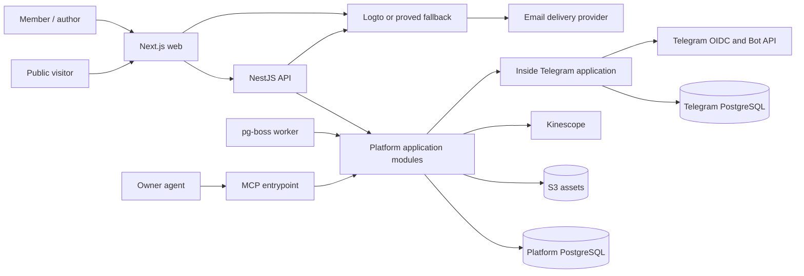
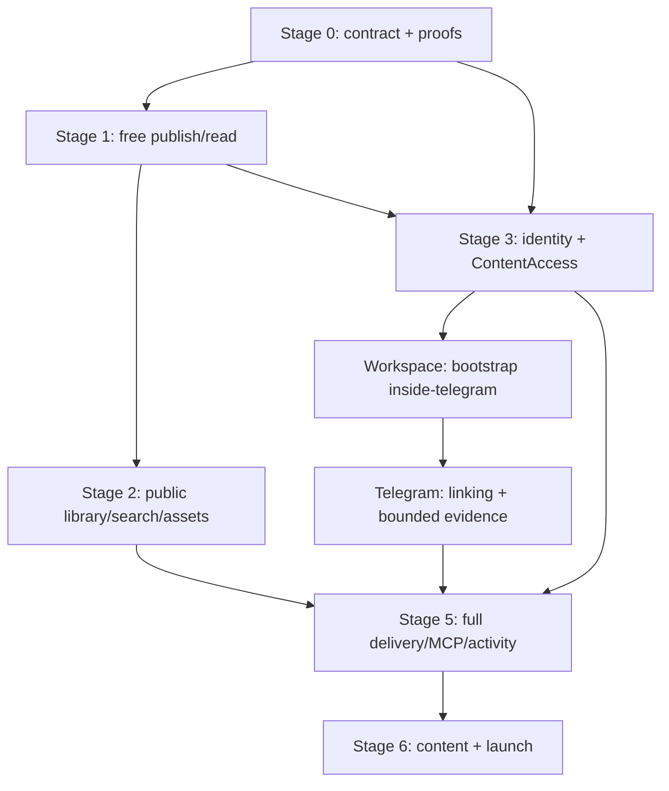

# Техническая спецификация Sachkov Inside Platform v1

Статус: proposed cross-repository specification для
[Workspace issue #40](https://github.com/sachkov-inside/workspace/issues/40).

Дата: 2026-08-21.

## 1. Результат и authority

Platform v1 становится каноническим домом материалов Inside: автор вручную создаёт и публикует
материалы, публичный посетитель находит и читает открытый контент, а участник связывает Platform
account с Telegram и получает закрытый контент, пока состоит в одном каноническом закрытом chat.

Эта спецификация фиксирует общую архитектуру, границы `platform` и будущего `inside-telegram`,
последовательность поставки и cross-repository зависимости. Она не является application ADR:

- продуктовый scope принадлежит каноническому
  [Platform MVP brief](https://github.com/sachkov-inside/platform/blob/main/docs/product/platform-mvp-brief.md);
- Platform implementation contract, код и ADR принадлежат `sachkov-inside/platform`;
- Telegram application contract, код и ADR будут принадлежать отдельному private repository после
  его bootstrap;
- Workspace хранит только общие продуктовые и cross-repository решения.

Ссылка на Platform brief задаёт human-facing authority, но не runtime или agent dependency:
подтверждённая cross-repository граница v1 полностью перечислена ниже и исполнима из Workspace.
Exact dependency versions, physical schema, package paths, deploy scripts и runbooks остаются только
в owning application repository.

При расхождении источников более позднее явное owner decision имеет приоритет, но owning document
должен быть синхронизирован до feature implementation. Сейчас канонический Platform brief всё ещё
говорит об автоматическом переносе Telegram-архива и обязательной material-specific discussion
link. Более поздний [аудит текущей публикации](../research/platform-current-publishing-audit.md)
подтверждает обратное: материалы создаются вручную без import/migration, а individual discussion
relation не входит в обязательный v1 scope. Первый Platform ticket устраняет это расхождение.

## 2. Scope и границы v1

### Входит

- публичные home, library, topic, series и editorial roadmap surfaces;
- индексируемые карточки всех опубликованных материалов и полное чтение free материалов;
- один закрытый Membership tier для bodies, assets, downloads и Kinescope video;
- email identity, Platform account и явное связывание с одной Telegram identity;
- author admin с draft, preview, validation, revisions и owner-controlled publish;
- MCP поверх тех же application commands и правил, что admin и REST;
- PostgreSQL full-text search, metadata navigation и related materials;
- reading state `прочитано / не прочитано` и минимальная history;
- ручное создание актуальных материалов с опорой на Telegram как visual reference;
- staging, production release, observability, backup и recovery contract.

### Не входит

- billing, Tribute integration, тарифная матрица, trial, promo, gifts или продажа отдельных серий;
- Telegram roster import, Telegram content export/import и migration pipeline;
- bot messaging, announcements, campaigns, moderation/admin UI или marketing automation;
- comments/community внутри Platform и обязательная ссылка на discussion каждого Material;
- multi-author workflow, UGC, real-time collaboration, CRDT/Yjs;
- AI search, autonomous publish, delegated member access для MCP;
- Redis, отдельный search service, event bus или новые deployables без доказанного consumer;
- instant recall уже доставленных bytes или выданной video license.

Промежуточные этапы не сокращают эту продуктовую границу. V1 считается выпущенной только после
Stage 6 и полного пользовательского launch gate.

## 3. Канонические входы

Спецификация использует решения по ссылкам и не копирует их полные matrices/runbooks:

- [content authoring](../research/platform-content-authoring-model.md) — versioned ProseMirror JSON,
  Tiptap adapter, immutable revisions, safe renderer и semantic MCP commands после proof;
- [current publishing audit](../research/platform-current-publishing-audit.md) — Material-centered
  model, ручное создание, evolving taxonomy, ordered Platform build Series;
- [PostgreSQL data access](../research/platform-postgresql-data-access.md) — Kysely + `pg` target,
  Drizzle fallback и migrations-as-authority после proof;
- [identity](../research/platform-identity-architecture.md) — Logto OSS target, Better Auth fallback,
  Platform-owned authorization;
- [Telegram Membership](../research/platform-telegram-tribute-membership.md) — отдельная application,
  OIDC linking, `getChatMember` evidence и five-minute freshness;
- [Kinescope lifecycle](../research/platform-kinescope-video-lifecycle.md) — выбранный provider,
  local Video identity, reconciliation и strict authorization adapter;
- [ContentAccess](../research/platform-content-access.md) — единый provider-neutral policy module;
- [delivery and recovery](../research/platform-delivery-recovery.md) — digest-pinned promotion,
  off-host telemetry, pgBackRest/PITR, RPO и RTO.

Общий словарь `Principal`, Membership evidence/entitlement и `ContentAccess` находится в
[`CONTEXT.md`](../../CONTEXT.md).

## 4. Cross-repository stack constraints

Platform уже bootstrapped как pnpm workspace. Следующие решения считаются принятыми и не требуют
повторного выбора в feature tickets:

| Concern | V1 contract |
|---|---|
| Runtime | Node.js 24 LTS; exact pin принадлежит Platform repository |
| Language/tooling | TypeScript strict и pnpm с exact lockfile |
| Web | Next.js App Router + React |
| Backend | NestJS + Fastify |
| Processes | `web`, `api`, `worker`, `mcp`; один backend codebase, отдельные thin entrypoint adapters |
| Contract | REST + OpenAPI; application rules не живут в controllers или transports |
| Transactional store | PostgreSQL 18; exact image pin принадлежит Platform repository |
| Jobs | `pg-boss`; product queues создаются только вместе с первым durable job |
| Search | PostgreSQL FTS, ranking и bounded RU/EN normalization; без отдельного engine |
| Deployment | Docker Compose, Caddy, immutable OCI images и digest-pinned release manifest |
| Assets | private/public objects и retained video originals во внешнем S3-compatible storage; provider выбирается owner |
| Video | Kinescope, существующие account и tariff; production adapter проходит credentialed proof |
| Telemetry | structured JSON logs, OpenTelemetry/Prometheus-compatible collection и off-host alerts |
| Backup | pgBackRest + continuous WAL archive/PITR; external object versioning |

Три choices остаются условными до Stage 0 proofs. Их fallback задан заранее, поэтому proof не
превращается в новое широкое исследование:

| Seam | Target | Fallback / no-go | Decision record |
|---|---|---|---|
| Identity | Logto OSS: email code, branded redirect, Next BFF, Nest JWT | Better Auth при failed UX, capacity, operations, restore или exit gate | Platform ADR после identity proof |
| Data access | Kysely + `pg`, Kysely Migrator/`kysely-ctl`, generated DB types | Drizzle + `pg` на pinned stable line при любом failed hard gate: transaction atomicity/escape, migrations/types/drift, FTS plan/ranking, parameterization/N+1, observability, overhead или operability | Platform ADR после data proof |
| Content document | versioned ProseMirror JSON + Tiptap | остановка для отдельного Portable Text comparison только при failed round-trip/renderer/MCP gate | Platform ADR после content proof |

Каждый implementing PR обновляет lockfile и фиксирует exact library versions. До зелёного proof
условный target нельзя описывать как окончательно выбранный stack или использовать в последующих
feature tickets.

Будущий `inside-telegram` начинает с TypeScript, Node.js 24 LTS, NestJS + Fastify, grammY и
PostgreSQL. Kysely + `pg` применяется там только после собственного bounded data proof; Platform и
Telegram application не делят database, source package или migration history.

## 5. System context и deployables

### Platform processes

| Process | Responsibility | Не владеет |
|---|---|---|
| `web` | SSR/RSC public/member/admin UI, BFF session, coarse access states | Membership rules, provider secrets, direct DB access |
| `api` | REST/OpenAPI adapters, auth mapping, uploads/callbacks и application commands | route-local domain policy |
| `worker` | durable projection, reconciliation и provider jobs | отдельная domain model или write path |
| `mcp` | authenticated MCP tools/resources поверх application interfaces | SQL, autonomous publish или borrowed browser Membership |

Platform processes продвигаются одним release manifest. Они могут масштабироваться отдельно, но
не становятся отдельными repositories/services до появления реального distribution seam.

`inside-telegram` — отдельный deployable, потому что владеет Telegram credentials, OIDC linking,
Bot API calls и своим failure/recovery lifecycle. Platform вызывает его только через versioned,
authenticated HTTP interface; tests используют in-memory adapter того же port.

## 6. Platform modules и seams

Modules ниже являются capability boundaries, а не обязательными npm packages. Внешний interface
каждого module остаётся малым; framework, SQL и provider types находятся в implementation или
adapter.

| Module | Interface responsibility | Основные owned facts |
|---|---|---|
| `IdentityPrincipals` | сопоставить trusted identity `(issuer, subject)` с local Principal и permissions | Principal, external identity mapping, account status |
| `ContentAuthoring` | создать/revise/validate/preview/publish/restore Material через optimistic commands | Material, draft/published pointers, revisions, author policy |
| `ContentSchema` | validate, migrate, safely render и extract projection из versioned document | schema versions, node/mark allowlist, fixture corpus |
| `ContentLibrary` | читать public/member projections, search, topic/series navigation и related materials | published projections и ranking rules |
| `ContentAccess` | `authorize(Subject, Resource, Action) -> AccessDecision` | provider-neutral access policy and reason codes |
| `MembershipEntitlements` | получить bounded evidence и построить Platform-owned entitlement | entitlement state/version/validity, refresh single-flight |
| `Assets` | upload intent, finalize, revision binding и bounded delivery | Asset metadata, immutable object keys/renditions |
| `Videos` | Kinescope upload/status/reconcile/bind/playback lifecycle | local Video identity, provider mapping/status |
| `ReadingActivity` | idempotently mark read/unread и list bounded recent history | Principal-to-Material state; не даёт content access |

Seam rules:

- application use case владеет transaction boundary; все participating repositories получают один
  explicit transaction capability;
- HTTP, RSC, MCP и worker вызывают одинаковые use cases, а не параллельные rule sets;
- PostgreSQL проверяется real integration tests; in-memory repository не считается доказательством
  migrations, FTS, constraints или transaction semantics;
- Logto, S3 и Kinescope являются true external dependencies и получают narrow internal ports плюс
  test adapters;
- Telegram application является remote-but-owned dependency: Platform владеет port и entitlement
  logic, production HTTP adapter только переносит versioned evidence;
- generic multi-provider interfaces не создаются до второго реального adapter. Provider-neutral
  `ContentAccess` существует потому, что policy используется многими delivery callers, а не ради
  гипотетической смены S3/Kinescope.

## 7. Логическая content и access model

Physical tables, indexes и package paths фиксируются Platform ADR/technical spec после proofs, но
v1 logical entities и cardinalities являются частью этой спецификации:

| Entity | V1 cardinality и invariant |
|---|---|
| `Principal` | одна local identity; 0..1 Telegram link; roles/permissions Platform-owned |
| `Material` | stable identity и slug; ровно один current draft pointer; 0..1 published pointer |
| `MaterialRevision` | immutable full snapshot; ровно один Material; versioned document, metadata и resource refs |
| `Topic` | Material имеет ровно один; одноуровневый managed dictionary |
| `Format` | Material имеет ровно один; описывает primary consumption mode, не Asset kind |
| `Tag` | Material имеет 0..N; managed dictionary с rename/merge без duplicate synonyms |
| `Series` | имеет 0..N ordered memberships; Material входит в 0..N Series |
| `SeriesMembership` | уникальная пара Series/Material и уникальная ordinal внутри Series |
| `Asset` | принадлежит Platform; revision ссылается на 0..N Assets; object key immutable |
| `Video` | local identity с одним Kinescope provider mapping; revision ссылается на 0..N Videos |
| `ExternalLink` | typed label + normalized URL; revision содержит 0..N links; URL не является entity identity |
| `NavigationPage` | editorial title/body + curated/query links; Roadmap использует эту роль |
| `MembershipEntitlement` | не более одного current `inside_membership` projection на Principal; always bounded |
| `ReadingState` | не более одной current state на Principal/Material; history bounded отдельной policy |

`MaterialRevision` хранит application-owned ProseMirror document с `schemaVersion`, stable block
`nodeId`, publishable metadata snapshot и local Asset/Video IDs. HTML, React tree, search text,
signed URLs, provider tokens и editor selection/history являются производными или ephemeral.

`Topic`, `Format`, `Tag` и `Series` создаются по мере ручного authoring. Candidate dictionaries из
аудита — fixtures для проверки модели, не seed ontology. Для v1 подтверждены только роли:

- «Создание Platform Inside» — ordered Series;
- Roadmap — `NavigationPage`;
- Library/material index — generated view, а не duplicated table;
- material-specific Telegram discussion relation отсутствует до отдельного owner decision.

Public `MaterialProjection` содержит title, summary/teaser, taxonomy, series и safe media metadata.
Он никогда не содержит closed body, private object locator или delivery credential. Published
body разрешается только через `publishedRevisionId`; draft resource нельзя получить через normal
read/download/play path.

## 8. Основные flows

### Authoring и publish

1. Admin или MCP отправляет application command с `materialId`, `baseRevisionId` и idempotency key.
2. `ContentAuthoring` нормализует IDs, проверяет permissions/references/limits через
   `ContentSchema` и сохраняет immutable revision в одной transaction.
3. Preview читает explicit revision и использует тот же safe renderer и `ContentAccess`, что
   published delivery.
4. Publish после explicit owner GO повторяет validation, atomically меняет published pointer,
   обновляет public/search projections и ставит только необходимые durable jobs.
5. Stale base возвращает `409`; MCP/admin не используют last-write-wins.

### Public и closed read

1. Public route читает только public projection; free body может быть shared-cacheable.
2. Closed route сначала получает Subject из trusted identity и вызывает `ContentAccess` до загрузки
   body в HTML/RSC payload.
3. Deny отображает public teaser/coarse state; allow загружает exact published revision.
4. Closed body, decision и credentials имеют `private, no-store`; shared cache и speculative
   protected prefetch запрещены.

### Membership linking и refresh

1. Signed-in Principal создаёт short-lived link transaction через Platform.
2. Browser проходит Telegram OIDC через Telegram application; та проверяет token, uniqueness и
   configured chat membership.
3. Telegram application возвращает normalized, signed/authenticated evidence без raw Telegram
   model. Platform строит собственный entitlement не позднее `validUntil` evidence.
4. Первый protected request после expiry делает single-flight refresh. Positive evidence живёт не
   более пяти минут; confirmed removal denies immediately; outage после expiry fails closed.

### Assets, downloads и video

1. `Assets` выдаёт author upload intent на random immutable key, finalize проверяет фактический
   type/size/checksum и только `ready` resource разрешает attach/publish.
2. Closed image/download сначала проходит `ContentAccess`; short-lived URL или stream bound to one
   Subject/Resource/Action и не живёт дольше access decision.
3. `Videos` создаёт Kinescope Tus upload server-side, принимает webhook только как hint и
   reconciles authoritative API state. Publish требует local `ready` Video.
4. Playback token и strict Kinescope callback повторно вызывают `ContentAccess`; любой mismatch,
   stale entitlement или outage возвращает deny.

### Search, navigation и related

- publish transaction обновляет search projection: title, summary, headings/body, asset labels и
  current metadata; closed body index остаётся server-side;
- PostgreSQL FTS ранжирует title выше summary/headings, затем taxonomy/body/assets; bounded RU/EN
  dictionary и audit fixtures проверяют typo/normalization cases;
- filters появляются только из реально используемых Topic/Format/Series values;
- related выдача сочетает metadata score и explicit author pins, не создавая AI dependency.

### MCP

- MCP аутентифицируется как отдельный service Principal с explicit author permissions;
- tools преобразуются в те же semantic commands, validation results и `409`, что admin;
- чтение/preview ресурсов вызывает `ContentAccess`; service Principal не наследует human
  Membership;
- `publish` технически доступен только как prepare/execute command с отдельным recorded owner GO;
  autonomous publish запрещён.

## 9. Нефункциональные требования

### Security и privacy

- все protected paths fail closed; ни identity, ни Telegram, ни Kinescope/S3 role не заменяют
  Platform authorization;
- cookie session: `Secure`, `HttpOnly`, explicit `SameSite`; mutations имеют CSRF + Origin checks;
- strict issuer/audience/expiry validation, short tokens, no secrets/tokens/raw sessions в logs;
- safe server renderer без raw HTML/MDX; allowlisted URLs/nodes, CSP и bounded document limits;
- closed bodies/objects физически или логически отделены от public projections/objects;
- every protected allow/deny, preview и dependency failure auditable через opaque local IDs;
- production/non-production secrets и databases разделены; plaintext secret не попадает в Git,
  image, CI artifact или telemetry.

### SEO

- home, library, topic, series, Roadmap, public cards и free materials server-rendered с stable
  canonical URLs, metadata, sitemap и crawlable internal links;
- closed Material card может индексироваться, но closed body отсутствует в HTML, RSC, structured
  data, search endpoint и shared cache;
- draft/preview/admin/account/MCP surfaces имеют noindex и не входят в sitemap;
- publish/unpublish обновляет canonical projection и invalidates only affected public cache.

### Accessibility и responsive UI

- critical journeys работают keyboard-only с видимым focus, semantic headings/landmarks,
  accessible names и announced validation/errors;
- editor, tables, code, player, upload progress и paywall имеют non-pointer alternatives;
- mobile и desktop evidence обязательно для UI PR; automated audit не имеет serious/critical
  findings, а author/read/link/play journeys проходят manual keyboard + screen-reader smoke;
- reduced motion, text zoom и narrow viewport не скрывают content или controls.

### Performance

На production-like staging с зафиксированным fixture corpus:

- public page server response p95 не выше 800 ms, protected non-video page p95 не выше 1.5 s без
  учёта user email/Telegram interaction;
- library search p95 не выше 300 ms при 10 000 Material projections и representative RU/EN set;
- public critical pages укладываются в LCP 2.5 s, INP 200 ms и CLS 0.1 на согласованном mobile
  profile;
- API/worker pool limits, query plans и payload/document limits измерены; Redis не добавляется как
  лечение непроверенного bottleneck.

Если staging profile или corpus делает budget нерепрезентативным, owner принимает новый measured
budget до production, а не исключает проверку.

### Observability и availability

- JSON logs содержат release/request/trace IDs и safe result codes; metrics покрывают HTTP, DB,
  queue, providers, entitlement refresh, callback, backup/WAL и worker heartbeat;
- `/health/live`, `/health/ready` и отдельный authenticated synthetic journey имеют разные роли;
- off-host probe и alert receiver не зависят от production VPS;
- public projection может работать при identity/Telegram outage; closed/mutation paths используют
  только ещё valid local evidence и затем fail closed.

### Backup, recovery и release

- release строится один раз и продвигается staging -> owner GO -> production по digest manifest;
- migration contract expand/migrate/contract сохраняет `N-1 app + N schema` compatibility;
- PostgreSQL + Logto state восстанавливаются pgBackRest/PITR; S3 objects имеют versioning/restore;
- Kinescope source originals хранятся независимо от provider до доказанного recovery/export и
  accepted retention policy; sample original восстанавливается и повторно ingest-ится в drill;
- production target: observed `RPO <= 1 hour`, `RTO <= 4 hours`;
- monthly database restore и quarterly/infra-change empty-VPS drill блокируют launch при failed
  coverage;
- rollback application manifest не запускает автоматическую down migration или destructive PITR.

## 10. Вертикальные этапы

Каждый этап заканчивается проверяемым результатом и не открывает следующий зависимый path раньше
exit gate.

### Stage 0 — синхронизировать contract и доказать условный stack

Среда: clean CI/ephemeral Compose; temporary callback environment только для identity proof.

Результат:

- Platform brief и local technical docs отражают принятые no-import/discussion/access decisions;
- Kysely/Drizzle decision доказана на Material, FTS, transaction и migration replay;
- ProseMirror/Tiptap decision доказана round-trip, safe render, schema migration и semantic MCP
  concurrency fixtures;
- Logto/Better Auth decision проходит полный canonical identity gate: branded redirect/mark и
  email-code policy; Next BFF и Nest validation; committed OIDC/M2M reason; Yandex horizon;
  capacity; private single-admin Console без MFA и compensating audit; provider email delivery;
  backup/restore, upgrade/rollback и portable exit evidence;
- accepted Platform ADR фиксирует каждый прошедший hard-to-reverse choice и exact versions.

Exit: нет незафиксированного conditional stack; failed target явно переключён на documented
fallback. Identity proof ticket создаётся только после owner inputs из раздела 13 и повторяет все
canonical gates выше. Ни product package, ни Telegram deployable не создаётся внутри proof без
соответствующего accepted decision.

### Stage 1 — author -> publish -> free read на staging

Среда: отдельный permanent staging после owner approval provider/budget/domain.

Результат: автор создаёт один representative Material через минимальный admin, preview-ит и после
owner GO публикует; anonymous visitor читает responsive free page по canonical URL. Revision,
transaction, safe rendering, public projection, migration и rollback tests проходят в CI/staging.

Exit: один реальный sanitized Material проходит edit/save/reload/publish/unpublish/restore без
semantic drift; draft не виден public; deployment manifest и smoke воспроизводимы.

### Stage 2 — public library, navigation, search и assets

Результат: visitor использует home, Library, Topic, Series и Roadmap, находит fixtures RU/EN search,
читает free materials и получает public images/files. Author управляет metadata, Series order,
assets и explicit related pins. SEO, accessibility и performance budgets измерены на staging.

Exit: generated views не дублируют data; candidate taxonomy создаётся только вместе с content;
private objects не доступны public; search acceptance set и 10k performance fixture зелёные.

### Stage 3 — identity и provider-neutral protected content

Результат: visitor создаёт email account, BFF session maps to Principal, а `ContentAccess` защищает
closed body/asset/download/video interfaces через один conformance matrix. До Telegram integration
Membership port использует только bounded test adapter; production closed access остаётся off.

Exit: anonymous/authenticated/active/expired/author/admin, two-Subject cache leak и dependency
outage cases зелёные для page/REST/MCP/resource paths; local identity ADR и operations proof
приняты.

### Stage 4 — bootstrap `inside-telegram` и включить real Membership

Trigger: Stage 3 стабилизировал versioned evidence port и Platform can consume it through HTTP and
in-memory adapters. До trigger не создаются bot messaging/admin/campaign packages или deployables.

Результат:

- Workspace bootstrap ticket создаёт подтверждённый private repository с собственным harness,
  CI, migrations, health, secrets и deployment contract;
- Telegram application реализует OIDC link, uniqueness/recovery invariants, read-only
  `getChatMember` evidence и authenticated internal interface;
- Platform сохраняет bounded entitlement и прекращает новые protected operations не позднее пяти
  минут после confirmed removal/evidence expiry.

Exit: existing member, non-member, removal, rejoin, replay, duplicate identity, lost admin/token и
outage проходят credentialed staging proof. Closed access включается только после этого gate.

### Stage 5 — complete delivery, MCP и member activity

Результат: author/MCP управляют полным v1 document set, private assets/downloads и Kinescope upload
-> process -> preview -> publish -> play; source original сохраняется независимо от Kinescope;
member читает, скачивает, смотрит и получает read state / recent history. Provider callbacks и
jobs idempotent/reconciled.

Exit: strict Kinescope callback, continued-play bound, provider recovery/export plus original
restore/re-ingest, S3 private delivery, cross-revision mismatch, provider outage, MCP
`409`/idempotency и reading-state access cases зелёные на staging.

### Stage 6 — content population и full user launch

Результат: актуальные материалы вручную пересозданы без import pipeline; real taxonomy определяет
действительно нужные filters/synonyms; staging manifest проходит owner acceptance и тот же digest
выходит production.

Exit:

- все v1 journeys, security/cache/a11y/performance budgets и provider acceptance зелёные;
- production monitoring/alerts, backup retention cycle, monthly restore и empty-VPS recovery drill
  доказывают RPO/RTO, включая sample Kinescope original restore/re-ingest;
- no-go при failed access, recovery, callback, migration или owner GO;
- дальнейшая публикация full materials происходит в Platform, Telegram остаётся announcement и
  community surface.

## 11. Dependency graph

Stage 2 и Stage 3 могут идти параллельно после Stage 1. Repository bootstrap начинается только
после stable Platform evidence port; implementation внутри нового repository начинается только
после bootstrap merge. Kinescope/S3 credentialed delivery зависит от `ContentAccess`, но provider
upload/reconciliation может быть доказан author-only fixture раньше real Membership.

## 12. Первые implementation tickets

Первый frontier состоит только из bounded work, которое можно начать без speculative provider
покупок или Telegram capabilities:

1. [Platform #16](https://github.com/sachkov-inside/platform/issues/16) — синхронизировать
   canonical product/technical contract: устранить расхождения brief, создать repository-local
   application specification/CONTEXT и перечислить ADR inputs. Это единственный текущий frontier,
   status `Ready`.
2. [Platform #17](https://github.com/sachkov-inside/platform/issues/17) — доказать PostgreSQL
   data-access contract: Material/SearchLibrary, transaction, Kysely migration/type-generation
   gates и Drizzle fallback. Native dependency: blocked by Platform #16.
3. [Platform #18](https://github.com/sachkov-inside/platform/issues/18) — доказать content document
   и MCP command contract: ProseMirror/Tiptap round-trip, renderer/search extraction, schema
   migration, semantic patching и concurrency. Native dependency: blocked by Platform #16.
4. [Workspace #60](https://github.com/sachkov-inside/workspace/issues/60) — bounded bootstrap
   `inside-telegram`. Создание private repository выполняется только на Stage 4 trigger и после
   owner confirmation имени; никакой messaging/admin scope не включается.

GitHub issues и доступные native dependencies создаются вместе с этой specification. Для #60
native `blocked_by` edge откладывается до появления конкретного Platform Stage 3 issue; сейчас
Project `Blocked` и body #60 явно фиксируют future dependency. Identity proof и Stage 1 delivery
ticket не получают `ready-for-agent`, пока owner не закроет входы из следующего раздела.

## 13. Open owner decisions и ADR inputs

| Decision | Нужна к этапу | Default/recommendation | Если не принято |
|---|---|---|---|
| Sync canonical brief с no-import и deferred discussion | Stage 0 | принять более поздние #39 decisions | feature implementation blocked |
| Logto redirect/mark, email-code UX и provider | identity proof | branded redirect + email code; выбрать monitored SMTP/HTTP delivery | Stage 3 blocked |
| OAuth/OIDC provider и M2M horizon | identity proof | подтвердить реальный use case в ближайшие 12 месяцев; иначе Better Auth сильнее | Logto value gate failed |
| Yandex horizon и identity link/unlink/recovery authority | identity proof | explicit verification; audited owner recovery без email-only merge | Stage 3 blocked |
| Один Logto OSS Console admin без MFA, private endpoint и audit compensation | identity proof | принять только с private access и Inside-owned Management API audit | Logto no-go |
| VPS capacity для Logto и Platform | identity proof | измерить published minimum + app/DB headroom | Logto no-go |
| Sanitized content fixtures и source-to-Material classification rules | content proof | owner-approved real Material; Telegram остаётся visual reference, не import source | content proof blocked |
| Content formatting limits, revision/asset retention, code/transcript indexing | content proof | минимальный audited set; no hard-delete referenced published data; code low weight, no transcripts | content ADR blocked |
| Permanent staging budget, providers/regions/domains и alert channel | Stage 1 | отдельный VPS, separate secrets/data | permanent staging/production blocked |
| Exact staging/production domains, callbacks и provider registrations | Stage 1 | separate stable registrations before external integration | callback proofs blocked |
| Blue/green capacity vs accepted recreate downtime | Stage 1/6 | blue/green при measured capacity | record downtime before launch |
| GitHub protected Environment reviewer vs owner-only `workflow_dispatch` | Stage 1/6 | protected Environment при доступном plan | production GO path blocked |
| S3 versioning/restore/pgBackRest compatibility и retention cost | Stage 2/6 | provider proof before private assets/backups | delivery/launch blocked |
| Kinescope original retention location/cost и provider recovery/export | Stage 5/6 | independent retained original + sample restore/re-ingest | video/launch blocked |
| Repository name `inside-telegram` | Stage 4 bootstrap | confirm current working name | repository creation blocked |
| Bot username/name/avatar/recovery owner и exceptional relink policy | Stage 4 proof | one recoverable Inside owner; no self-service replacement | credentialed proof blocked |
| Kinescope strict callback mechanics и acceptable continued-play window | Stage 5 | strict fail-closed; measure current plan | video remains unavailable |

Hard-to-reverse Platform ADR inputs after green proofs:

- data authority, migration runner и transaction seam;
- canonical document schema, revision model, safe renderer и MCP commands;
- identity provider/BFF/token mapping и recovery/exit contract;
- `ContentAccess` placement and conformance surface;
- private Asset delivery mechanism;
- Kinescope upload/reconciliation/strict authorization mechanics;
- release, secrets, migration compatibility и recovery shape.

`inside-telegram` ADR inputs after bootstrap/proof:

- OIDC linking, identity uniqueness/recovery and exact validation policy;
- Membership evidence interface, five-minute validity and outage semantics;
- grammY/Nest/PostgreSQL adapters and credential/deployment ownership.

No ADR is created in Workspace for these application implementation choices.
