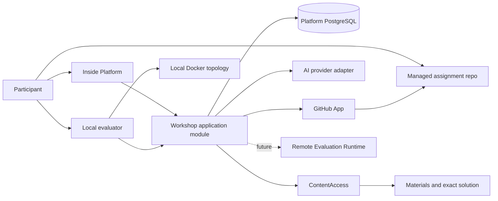

# Спецификация фундамента Inside Production Workshop v1

Статус: proposed shared specification из
[Workspace issue #98](https://github.com/sachkov-inside/workspace/issues/98) для human outcome
[#97](https://github.com/sachkov-inside/workspace/issues/97).

Дата: 2026-09-02.

## 1. Результат и authority

Inside Production Workshop, далее **Workshop** или «Мастерская», становится отдельным learning
workflow внутри Platform для разработчиков, которые уже умеют писать код, но хотят получить опыт
решения правдоподобных production-ситуаций. Участник работает локально в настоящем repository,
принимает и объясняет инженерные решения, проходит несколько слоёв проверки и изучает связанные
Materials без превращения опыта в набор coding puzzles.

Эта спецификация фиксирует shared product contract, cross-repository границы, logical model,
trust boundary первой beta и направление эволюции. Она не является application ADR или
implementation specification:

- Workspace владеет этим shared product contract, общим языком и delivery routing;
- `sachkov-inside/platform` владеет learner-facing product brief, application model, UI, GitHub
  integration, Workshop access, попытками, AI feedback и собственными ADR;
- текущий Platform v1 остаётся каноническим foundation для Account, Materials, ContentAccess и
  authoring, но Workshop не входит в его accepted delivery scope;
- конкретный local evaluator, будущий remote Evaluation Runtime и новый repository получают
  отдельного owner только после доказанной runtime/trust/lifecycle границы;
- точные dependencies, schemas, package paths, deploy scripts, prompts, models и runbooks остаются
  в owning application repositories.

Позднее явное owner decision может изменить этот документ, но owning product brief и application
specification должны быть синхронизированы до реализации соответствующей функции.

## 2. Product thesis и аудитория

### 2.1 Проблема

Обычные тренажёры хорошо проверяют SQL, синтаксис, алгоритм или изолированную функцию, но слабо
воспроизводят работу в существующей системе. Coding agent ещё сильнее обесценивает задачу, где
достаточно перевести полное условие в код и пройти известные тесты.

Production-мышление проявляется иначе: разработчик восстанавливает контекст, замечает скрытые
ограничения, выбирает компромисс, безопасно меняет систему, собирает operational evidence и может
объяснить последствия своего решения. Workshop тренирует именно этот цикл; конкретные технологии
и будущие evidence для резюме поддерживают его, но не заменяют.

### 2.2 Входной контракт

Workshop предназначен человеку, который уже умеет программировать и способен локально работать с
Git, приложением и базовыми developer tools. Формальный grade не является входной границей:

- основной ранний спрос ожидается от job seekers, junior+ и работающих разработчиков, которым не
  хватает production-практики;
- один Workshop не делится на отдельные junior и middle продукты;
- сложность задаёт Production Case: количество неизвестных, глубина существующей системы, число
  затронутых dependencies, неоднозначность компромиссов и требуемая сила evidence;
- обучение программированию с нуля и подробный scaffolding базового CRUD не входят в обещание.

Docker-compatible runtime является обязательным prerequisite для Case Variants, использующих
локальную infrastructure topology. Platform показывает prerequisite и preflight до начала кейса.

### 2.3 Покупаемый результат

Участник должен уметь:

1. разобраться в неполном production-контексте;
2. сформулировать risks, invariants и alternatives;
3. реализовать решение в существующем или новом коде;
4. проверить функциональное и operational поведение;
5. объяснить trade-offs и адаптировать решение к изменившимся условиям;
6. отличить работающее решение от случайного прохождения happy-path тестов.

Workshop не обещает grade, трудоустройство, персональное менторство, безлимитный review автора или
независимую профессиональную сертификацию.

## 3. Product и commercial boundary

Workshop является отдельным продуктом Inside, а не обязательной частью Membership:

- целевой покупатель сможет получить Workshop без постоянной активной Membership;
- Workshop Entitlement не является MembershipEntitlement и не выводится из Telegram roster;
- Workshop может включать доступ только к явно связанным Materials, не открывая всю Membership;
- текущие участники Membership могут получить time-bounded beta access и будущий launch credit;
- Telegram остаётся местом community, вопросов и сезонных групповых разборов;
- Platform владеет кейсами, assignment, attempts, feedback и progression, но не создаёт comments
  или chat в первом slice.

Финальная цена, длительность commercial access, состав Edition, скидки, bundle и право на будущие
ветки не определены. До отдельного owner decision нельзя обещать покупателю весь будущий каталог
навсегда.

## 4. Learning architecture

### 4.1 Core и Learning Branches

Workshop имеет короткий core, который знакомит с общим production cycle, и расширяемые Learning
Branches. Верхний уровень taxonomy намеренно гибридный:

- technology-oriented branches могут называться Kafka, PostgreSQL, Redis или CI/CD;
- capability-oriented branches могут описывать observability, security, reliable messaging,
  system design или microservices;
- technologies, skills, difficulty и prerequisites остаются разными facets даже когда UI
  показывает их рядом;
- Learning Branch не равна Platform Topic, Material Series или Git branch.

Polished interactive skill tree не входит в первый slice. До реальных веток Platform показывает
простой ordered flow и сохранённый mastery result.

Workshop имеет ровно один ordered core и 0..N Learning Branches. Core и branches ссылаются на
Production Cases через placements, а не копируют CaseSpec. Placement задаёт ordinal и explicit
prerequisite case IDs; отсутствие prerequisite не выводится из визуального соседства карточек.

Progression вычисляется для Account:

- core открывает первый Case сразу, а следующий — после completed prerequisite placements;
- branch может быть видна до выполнения prerequisites, но locked Case явно объясняет условие;
- Production Case считается completed, когда любой его supported Case Variant имеет `Verified`
  Attempt, если placement отдельно не требует variant-specific outcome;
- один Case может входить в несколько branches без повторного прохождения;
- первый slice содержит один сразу доступный core Case и не требует generic graph engine.

### 4.2 Production Cases

Базовая единица Workshop — самостоятельный многоэтапный Production Case. Вся Мастерская не живёт
в одном учебном приложении; отдельная Learning Branch может переиспользовать один fictional product
и накопительный контекст, когда это усиливает навык.

Editorial bias — brownfield-first: участник чаще получает существующий сервис, историю решений,
дефект, инцидент или новое ограничение. Greenfield допустим, когда сам learning outcome требует
проектирования с нуля.

Типичный case lifecycle:

1. восстановить систему и problem context;
2. назвать invariants, unknowns, constraints и risks;
3. предложить решение и alternatives;
4. изменить код/configuration/infrastructure;
5. собрать functional и operational evidence;
6. отправить Attempt и пройти adaptive AI defense;
7. получить mastery feedback;
8. открыть авторский разбор и сравнить alternatives.

### 4.3 Multiple stacks

Один Production Case может иметь несколько Case Variants. Поддержка публикуется как честная
матрица `Production Case × stack`:

- AI-generated port не считается поддержанным без common conformance scenarios и экспертной
  приёмки ecosystem-specific поведения;
- варианты сохраняют общий learning outcome и observable contract, но starter code, build adapter,
  diagnostics и idiomatic solution могут различаться;
- первый vertical slice имеет два verified stack variants;
- точные первые два стека выбираются вместе с representative case, а не заранее для всего
  каталога;
- отсутствие варианта не блокирует публикацию кейса на уже проверенном стеке.

## 5. Versioned CaseSpec

Case authoring первой версии происходит через versioned CaseSpec в закрытом Git repository.
Универсальный visual admin builder появится только после нескольких реальных кейсов, когда schema
подтверждена usage.

CaseSpec логически содержит:

| Область | Contract |
|---|---|
| Identity | stable case ID, version, lifecycle state и compatibility policy |
| Learning | outcome, prerequisites, difficulty signals, skills и technologies |
| Scenario | context, stages, constraints, supplied artifacts и allowed assumptions |
| Materials | prerequisites, optional references, hints и post-attempt author solution |
| Variants | supported stacks, starter baseline, toolchain/evaluator adapter versions |
| Evaluation | public scenario contract, required evidence и mastery rubric |
| Reveal | qualifying-attempt rule и exact solution resources |
| Operations | expected runtime/resources, logs, timeouts и support diagnostics |

CaseSpec не содержит secrets, platform credentials или hidden remote scenario payloads. Будущий
remote evaluator связывает закрытый test version с case version внутри trusted runtime.

Изменение learning outcome, starter baseline или evaluator meaning создаёт новую case version.
Published Attempts продолжают ссылаться на exact versions, с которыми были интерпретированы.

## 6. Logical model и invariants

Physical schema и package ownership принадлежат Platform implementation specification. Shared
logical entities имеют следующие роли:

| Entity | Cardinality и invariant |
|---|---|
| `Workshop` | содержит ровно один ordered core и 0..N Learning Branches; задаёт access/progression boundary |
| `LearningBranch` | содержит 1..N ordered Case memberships; Case может входить в 0..N branches |
| `CasePlacement` | включает один Production Case в core или Learning Branch, задаёт ordinal и 0..N explicit prerequisites |
| `ProductionCase` | stable identity; имеет 1..N immutable published versions |
| `CaseVariant` | принадлежит одной case version и одному supported stack identity |
| `WorkshopEntitlement` | связывает Account с bounded Workshop scope независимо от Membership |
| `Assignment` | принадлежит одному Account и одному Case Variant; хранит starter baseline и managed repository identity |
| `LocalEvaluationRun` | mutable learner-side run; сам по себе не является Attempt или trusted evidence |
| `Attempt` | immutable evaluation identity и inputs: Assignment, exact source revision и case/variant/evaluator versions |
| `AttemptEvidence` | append-only typed evidence set одного Attempt: source snapshot, local report, Decision Record и AI defense transcript |
| `DecisionRecord` | принадлежит Attempt и объясняет constraints, alternatives, choice и expected consequences |
| `AIDefense` | принадлежит Attempt; содержит versioned questions/answers и advisory rubric evidence |
| `MasteryResult` | принадлежит Attempt; хранит dimensions, feedback и completion state |
| `SolutionReveal` | фиксирует, когда exact author solution стал доступен для Account/Case version |
| `WorkshopProgress` | derived Account projection по placements и completed Production Cases; не является authority для Attempt result |

Ключевые invariants:

- Production Case, Case Variant, Assignment и Git repository не взаимозаменяемы;
- Git push или local test run не создаёт Attempt;
- каждый Attempt ссылается на один exact source revision и никогда не переносится на новый HEAD;
- количество промежуточных commits не ограничено и не меняет evaluation semantics;
- Platform хранит versions и evidence provenance даже когда learner UI показывает один итоговый
  статус;
- Membership не становится неявным permanent Workshop purchase;
- один Case Variant не считается parity-доказательством другого стека.

### 6.1 Canonical states

| Entity | States и transitions |
|---|---|
| `Assignment` | `provisioning → ready → archived`; provisioning failure даёт `unavailable`, из которого explicit retry создаёт/восстанавливает ready Assignment без фиктивного Attempt |
| `LocalEvaluationRun` | `running → passed`, `failed` или `aborted`; состояние learner-controlled и никогда само не завершает Case |
| `Attempt` | `submitted → defense_pending → evaluated`; immutable inputs не меняются, AI outage оставляет resumable `defense_pending` |
| `AIDefense` | `pending → in_progress → completed`; retry продолжает ту же versioned defense, а не создаёт новый technical Attempt |
| `MasteryResult` | terminal `needs_work` или `verified` для одного evaluated Attempt; новый результат требует нового Attempt |
| `SolutionReveal` | derived `locked → revealed`; обратный переход запрещён для той же Account/Case version |
| `WorkshopProgress` | derived `locked`, `available`, `in_progress` или `completed` per placement; source authority — prerequisites и Attempt results |

`AttemptEvidence` добавляется только известными typed records и не переписывает уже принятый record.
MasteryResult может ссылаться только на evidence versions того же Attempt.

## 7. Assignment и GitHub UX

### 7.1 Managed assignment

Первый slice использует dedicated GitHub organization и private repository per Assignment.
GitHub остаётся source host и transport, а не grader runtime.

Happy path:

1. Account с Workshop Entitlement нажимает «Начать кейс» и выбирает доступный Case Variant.
2. Platform через GitHub App создаёт private assignment repository из versioned starter baseline,
   связывает его с Account и показывает готовую clone command.
3. Preflight объясняет Docker, GitHub access, supported architecture, required resources и
   platform-owned local evaluator command.
4. Участник клонирует repository и работает локально любым количеством commits.
5. Участник пушит изменения в managed default branch; специальные branch names, tags и commit
   message conventions не требуются.
6. Platform показывает текущий pushed HEAD, SHA, время синхронизации и readiness.
7. Local evaluator отправляет structured report для этого HEAD.
8. Участник явно подтверждает «Проверить этот commit»; Platform скачивает полный source snapshot
   exact SHA через GitHub App и создаёт immutable Attempt.

Platform не запускает evaluation на каждый push. Возможная будущая отправка другого commit создаёт
новый Attempt, а не перезаписывает старый.

### 7.2 Error prevention

UX обязан предотвращать или ясно диагностировать:

- GitHub App не установлен или Account не связан с нужной GitHub identity;
- repository не создан, удалён, inaccessible или больше не соответствует Assignment;
- local checkout указывает на чужой remote;
- HEAD не pushed или Platform видит другой SHA;
- Docker/Compose отсутствует, имеет несовместимую версию или недостаточно ресурсов;
- заняты required ports, unsupported CPU architecture или dependency download failed;
- report относится к другой case/variant/evaluator version;
- source snapshot недоступен или изменённый SHA не принадлежит Assignment repository;
- повторное нажатие пытается отправить уже существующий Attempt.

No-op commit, branch naming или ручной ввод SHA не являются частью happy path.

## 8. Local evaluation v1

### 8.1 Scope

Технические scenarios первого slice выполняются на устройстве участника. Platform-owned evaluator
предоставляет одну documented command для preflight, запуска public scenarios и отправки report.
Docker-compatible runtime обязателен для воспроизводимой topology с Kafka, PostgreSQL, Redis и
другими dependencies.

Local evaluator:

- выбирает adapter по exact Case Variant и evaluator version;
- проверяет repository identity и pushed HEAD;
- поднимает platform-owned local topology;
- выполняет public functional/operational scenarios;
- собирает bounded logs, timings, tool versions и declared environment;
- отправляет structured report, связанный с one-time attempt draft и commit SHA;
- не получает long-lived Platform или GitHub credentials;
- не содержит secret future remote tests.

Case adapter задаёт controlled build/run contract. Participant-owned Dockerfile или arbitrary
pipeline не является обязательным extension point beta; конкретный case может разрешить изменение
infrastructure files только когда это входит в learning outcome.

### 8.2 Trust boundary

Участник полностью контролирует local machine, source code, Docker runtime и evaluator process.
Поэтому nonce, client signature или structured schema могут предотвратить случайный replay, но не
доказывают честность выполнения.

Owner decision для v1: Platform доверяет принятому local report и использует один learner-facing
статус `Verified`. Этот статус означает прохождение contract Мастерской, а не независимую
adversarial certification или employer-facing proof. Public portfolio/certificate не входит в
первый slice.

Внутри Platform всё равно сохраняются:

- source revision и starter revision;
- case, variant, evaluator и report schema versions;
- execution method `local`;
- scenario results и bounded diagnostic evidence;
- timestamps, Account и Assignment identity;
- decision record, AI defense и mastery rubric versions.

Добавление remote execution позднее усиливает mechanism для новых attempts, но не создаёт второй
learner-facing completion badge и не отменяет исторические completed cases.

### 8.3 Attempts и cost control

Количество attempts не ограничено как learning policy. Platform применяет readiness gates,
cooldown, concurrency и abuse limits к дорогостоящим operations и AI feedback. Every attempt
immutable; повторная работа происходит через новый commit и новый Attempt.

## 9. Multilayer evaluation и result

Case считается completed и получает один статус `Verified`, когда выполнены все условия:

1. accepted structured local report сообщает pass по required public scenarios;
2. Platform получила immutable source snapshot exact pushed commit;
3. участник отправил Decision Record;
4. adaptive AI defense завершена;
5. Mastery Result сохранён для всех required dimensions.

Базовые rubric dimensions:

| Dimension | Проверяет |
|---|---|
| `correctness` | observable contract и отсутствие известных functional violations |
| `reliability` | failure handling, retries, consistency и bounded recovery |
| `operability` | diagnostics, logs/metrics/traces и понятное runtime behaviour |
| `decision_quality` | constraints, alternatives, trade-offs и последствия выбора |

AI не является единственным authority для technical pass. Local scenarios определяют declared
technical result; AI объясняет evidence, задаёт questions/counterfactuals и предлагает rubric
assessment. Спорный AI вывод не превращает технически passing Attempt в скрытый fail без отдельного
owner-approved policy и appeal path.

Mastery UI показывает dimensions и feedback, а не global leaderboard или один псевдоточный score.

## 10. AI-assisted work и adaptive defense

Использование coding agents разрешено. Workshop оценивает инженерную ответственность за результат,
а не ручной набор кода. AI-first skill не является обязательным learning outcome каждого кейса.

Для feedback Platform AI получает минимально необходимый Workshop context:

- exact CaseSpec/version и rubric;
- полный source snapshot только assignment repository на submitted SHA;
- cumulative diff от starter revision;
- local report и bounded diagnostics;
- Decision Record и ответы текущей defense.

AI не получает другие repositories участника, GitHub profile data сверх нужной identity, platform
secrets или unrelated Account content.

Adaptive defense задаёт короткие вопросы, зависящие от реального решения:

- почему выбран этот consistency/retry/observability contract;
- какое ограничение было главным;
- что сломается при конкретном изменении traffic, dependency или failure mode;
- как участник отличит symptom от root cause;
- какую alternative он отверг и при каких условиях вернулся бы к ней.

Prompts, model, sampling, rubric calibration, retention и redaction принадлежат Platform
application specification. AI output хранит model/prompt/rubric version и ссылки на evidence,
чтобы feedback можно было диагностировать.

## 11. Materials, hints и solution reveal

Platform Material остаётся единственной content entity; Workshop не копирует body или video в
CaseSpec. Case version связывается с Materials ролями:

- prerequisite foundation;
- optional reference;
- hint;
- exact author walkthrough/solution;
- post-case alternatives и deeper dive.

General Materials и hints доступны участнику сразу. Exact solution конкретного кейса открывается
после qualifying attempt, чтобы застрявший участник мог доучиться, не сводя первую попытку к
копированию.

Qualifying attempt требует:

- ready Assignment и source changes относительно starter revision;
- pushed source revision, доступный Platform;
- заполненный Decision Record;
- выполненный public local evaluation flow, даже если required scenarios ещё не прошли.

Platform фиксирует `solutionRevealedAt`; один итоговый `Verified` status не должен уничтожать эту
историю. Exact solution нельзя получить через direct Material URL без Workshop access/reveal
decision.

## 12. Seasons и author boundary

Workshop имеет evergreen content access и периодические seasons:

- человек решает кейсы в своём темпе без hard individual deadlines;
- season создаёт общую cadence, темы, live events и авторские разборы;
- AI feedback доступен на каждую accepted attempt в рамках operational limits;
- базовая цена не обещает personal author review каждому;
- Кирилл разбирает характерные решения и отдельные participant examples выборочно;
- policy согласия на публикацию participant code/identity определяется перед первым записываемым
  разбором и не блокирует technical slice.

## 13. First end-to-end vertical slice

### 13.1 Входит

- beta Workshop Entitlement для Accounts с current MembershipEntitlement через controlled grant;
- простая Workshop/case page без polished skill tree;
- один representative multi-stage Production Case;
- два supported Case Variants и coverage metadata;
- versioned CaseSpec in Git и linked Materials;
- managed private GitHub Assignment repository;
- clone/preflight/readiness UX без branch/tag conventions;
- Docker-compatible local evaluator и public scenarios;
- explicit submission exact pushed HEAD и immutable source snapshot;
- unlimited versioned Attempts с operational limits;
- Decision Record;
- adaptive AI defense и advisory feedback;
- mastery rubric и один learner-facing `Verified` completion status;
- exact solution reveal после qualifying attempt;
- Telegram handoff для season/community.

### 13.2 Не входит

- commercial checkout, финальная price/Edition/access policy;
- больше одного Production Case или обязательный полный core/branch catalog;
- polished interactive skill tree, XP, leaderboard или social graph;
- Platform comments/chat, peer review или guaranteed personal review;
- public portfolio, employer verification, certificate или identity proctoring;
- remote hidden/fault-injection execution;
- GitHub Actions как grader runtime;
- arbitrary participant Dockerfiles как общий build contract;
- universal visual CaseSpec admin builder;
- создание отдельного microservice/repository только ради Go, AI или future scale;
- production release/deploy/SLA/backup contract.

### 13.3 Slice acceptance journey

Slice принят, когда один beta Account без ручного исправления branch/repository state проходит путь:

1. получает access;
2. открывает case и связанные Materials;
3. выбирает один из двух stack variants;
4. создаёт и клонирует Assignment;
5. проходит preflight и запускает local scenarios;
6. пушит решение и видит совпадающий HEAD в Platform;
7. отправляет structured attempt;
8. заполняет Decision Record и проходит adaptive AI defense;
9. получает mastery feedback и `Verified` после всех required layers;
10. открывает author solution и может создать следующую attempt.

Negative acceptance покрывает mismatched repository/SHA, unsupported Docker, stale evaluator,
failed report, empty changes, unavailable GitHub, duplicate submission, AI timeout, direct solution
access before reveal и Account без Workshop Entitlement.

## 14. System ownership и seams

Platform owns the control plane:

- access and Account identity;
- Workshop catalog/progression projection;
- Assignment and GitHub integration;
- source snapshot and immutable Attempt;
- Decision Record, AI defense, mastery result and reveal policy;
- Material relationships and ContentAccess calls;
- job orchestration required by its own application lifecycle.

Local evaluator owns only reproducible learner-side execution and report generation. It does not
own Workshop access, completion policy or source authority.

Future Remote Evaluation Runtime is an execution plane, not a second product backend. It receives
versioned evaluation work and returns evidence through a narrow contract; it does not read Platform
database, decide entitlement or call GitHub with broad credentials.

### 14.1 Architecture fitness contract

Каждый implementing repository обязан поставить guardrail вместе с первым реальным seam. Shared
specification задаёт ближайшую fitness function, но не выдумывает package path до application
design:

| Rule / seam | Owner | Closest executable fitness |
|---|---|---|
| Workshop access не выводится из Membership | Platform Workshop access module + ContentAccess | access-matrix test принимает explicit WorkshopEntitlement и negative fixture отклоняет один MembershipEntitlement там, где Workshop grant обязателен |
| Attempt source authority — managed repository и exact SHA | Platform GitHub/Assignment module | integration contract принимает matching repository/SHA и negative fixtures отклоняют foreign repo, unpushed/stale SHA и report без source snapshot |
| CaseSpec, evaluator report и AI rubric имеют совместимые versions | Platform + owning local evaluator module/repository | shared schema/conformance corpus с representative valid case и invalid version/field fixtures в full checks обоих owners |
| AI не выдаёт access и не является единственным technical pass authority | Platform Workshop evaluation module | controlled-provider test сохраняет technical evidence при AI outage; negative fixture доказывает, что AI-only result не создаёт Verified Attempt |
| Local evaluator не владеет completion policy | Platform Workshop module + local evaluator adapter | contract test показывает одинаковый report input для `needs_work` и `verified` policy cases; evaluator не возвращает Platform status |
| Future remote worker не читает Platform DB и не получает broad GitHub credentials | owning Evaluation Runtime | controlled adapter test проходит через one-use snapshot/evidence contract; negative fixture пытается использовать forbidden credential/network route и обязана завершиться deny |
| Новый deployable не делит runtime package или database с Platform | owning application repository | dependency/import guardrail и integration contract появляются в том же change, который создаёт process boundary |

Последние две remote/deployable fitness functions пока не исполнимы: соответствующих processes и
owning repositories ещё нет. Их создание является trigger, после которого prose-only rule без
positive representative case и failing negative fixture не считается implementation-ready.

## 15. Technology-selection policy

Workshop is allowed to become polyglot, but language preference alone never creates a microservice.
Every new deployable needs at least one demonstrated reason:

- independent trust/security boundary;
- materially different scaling or resource profile;
- independent release/failure lifecycle;
- platform/runtime compatibility that the existing process cannot satisfy cleanly;
- clear ownership that reduces, rather than moves, coordination cost.

Confirmed direction by component:

| Component | Direction | Decision status |
|---|---|---|
| Platform web/control plane | Existing TypeScript/Next/Nest modular Platform | Confirmed by Platform contract |
| Workshop application logic | Start inside Platform modules; no network service seam without evidence | Confirmed direction |
| AI feedback orchestration | Start near Attempt/rubric/access logic in Platform TypeScript worker/module | Candidate baseline |
| Cross-platform local evaluator/CLI | Go is the leading candidate; TypeScript remains fallback | Requires representative prototype |
| Future remote evaluation worker | Go is a strong candidate for process/container orchestration and low-footprint worker | Deferred until remote scope |
| Case Variant toolchains | Match learner stack; isolated adapters/containers do not dictate control-plane language | Confirmed principle |
| Isolation substrate | Container/runtime technology, not application language, owns code-execution security | Confirmed principle |

Go must prove the local evaluator requirements before acceptance:

- distribution/update on supported macOS, Windows and Linux environments;
- Docker/Compose orchestration and cancellation;
- Git/repository/HEAD discovery;
- device/session authentication without long-lived secrets;
- stable structured report schema and bounded log streaming;
- testability of platform/CLI protocol and compatibility policy.

TypeScript is preferred for AI orchestration only while it remains part of Platform's domain and
operational lifecycle. A separate AI microservice requires measured model concurrency, security,
deployment or ownership evidence; «работа с AI» сама по себе не является причиной.

Cross-process contracts use versioned wire schemas and conformance fixtures. Repositories do not
share runtime source packages, databases or migration history.

Hard-to-reverse language/runtime choices receive owning application ADR only after prototype
evidence and owner approval. Эта shared specification намеренно не создаёт ADR для ещё не выбранного
компонента.

## 16. Future remote evaluation

Remote execution вводится отдельной specification после local slice и реального case evidence.
Shared direction:

- GitHub остаётся source transport, но GitHub Actions не является compute dependency;
- Platform control plane сохраняет immutable source snapshot и создаёт versioned Evaluation work;
- isolated workers получают snapshot через bounded one-use access и не имеют Platform/GitHub
  credentials внутри participant sandbox;
- build и test выполняются отдельно; hidden harness не mount-ится в participant process;
- network default-deny, CPU/RAM/PID/disk/time/log limits и full cleanup обязательны;
- evidence связывает source SHA, artifact digest, case/test/adapter/runtime versions и verdict;
- execution runtime скрыт за интерфейсом, позволяющим начать с dedicated gVisor worker и перейти к
  disposable VM, Kata или Firecracker при более сильном threat model;
- Kubernetes является orchestration choice, а не sandbox сам по себе.

Remote runtime не требуется для first slice и не должен блокировать local learner feedback.
Reference для будущего design: [gVisor security model](https://gvisor.dev/docs/architecture_guide/security/),
[Kubernetes RuntimeClass](https://kubernetes.io/docs/concepts/containers/runtime-class/) и
[Firecracker production host setup](https://github.com/firecracker-microvm/firecracker/blob/main/docs/prod-host-setup.md).

## 17. Security, privacy и operational boundaries

First slice обязан:

- использовать least-privilege GitHub App permissions и short-lived tokens;
- хранить repository IDs и exact revisions, а не доверять URL/branch name;
- не передавать Platform/GitHub/AI secrets в assignment repository или local topology;
- ограничивать uploaded logs/report/source size и redaction известных secret formats;
- не исполнять participant source внутри Platform API/worker process;
- предупреждать, что assignment repository предназначен только для case solution и не должен
  содержать рабочие или персональные secrets;
- версионировать evaluator/report/rubric/prompt contracts;
- иметь idempotent attempt creation и понятные retry states;
- отделять AI feedback от authorization и technical pass;
- определить retention/deletion source snapshots, AI conversations и assignment repositories до
  real paid launch.

Записанные author group reviews требуют отдельной consent policy до использования participant code
или identity. Эта policy не блокирует first technical slice, если разбор использует только
author-owned examples.

## 18. Edge scenarios

| Scenario | Required behaviour |
|---|---|
| Membership истекла во время beta | Workshop access следует explicit beta grant, а не случайно исчезает вместе с Membership, если grant уже выдан с собственной validity |
| Один Case поддерживает только один stack | Case публикуется с честной coverage matrix; отсутствующий variant не симулируется |
| Участник посмотрел exact solution после attempt | reveal сохраняется в history; последующие attempts не переписывают прошлое |
| Local report подделан | v1 trust model может принять его; внешний certification claim запрещён, а source/AI layers остаются доступны для диагностики |
| GitHub недоступен после local pass | report не создаёт Attempt без immutable source snapshot; participant может retry позднее |
| AI provider недоступен | Attempt остаётся resumable в состоянии ожидания defense; technical evidence не теряется |
| CaseSpec обновлён во время работы | Assignment/Attempt продолжают ссылаться на начатую case version; migration требует explicit policy |
| Starter repo удалён | существующий Assignment сохраняет baseline identity; новый start закрывается с operational error |
| Case требует CI/CD или external provider | contract получает bounded simulator/provider seam; unrestricted production credentials участнику не выдаются |
| Будущий remote grader добавлен | новый runtime усиливает future evaluation, не меняя один learner-facing completion status исторических cases |

## 19. Success evidence первой beta

Beta оценивает не коммерческую масштабируемость всего каталога, а жизнеспособность learner loop:

- Account проходит journey без ручного исправления Git/GitHub state автором;
- local preflight отделяет environment errors от case failures;
- scenario reports воспроизводимы на двух supported variants;
- участники создают содержательные Decision Records и отвечают на solution-specific AI questions;
- author review находит в mastery feedback полезные, а не generic observations;
- exact solution reveal помогает застрявшим, не открываясь до qualifying attempt;
- support load, AI cost, completion time и repeated-attempt patterns измерены;
- один CaseSpec можно изменить/version без ручного переписывания historical attempts.

Go/no-go расширения каталога принимается по фактическим прохождениям и authoring/support cost, а не
по существованию красивого skill-tree UI.

## 20. Delivery sequence и repository routing

Эта последовательность не создаёт implementation tickets до owner acceptance specification:

1. **Workspace — shared specification.** Принять этот документ и glossary через #98.
2. **Workspace — bounded Wayfinder map.** Выбрать representative first case, два stack variants,
   local evaluator prototype и AI defense proof; decision children закрывают только неизвестные.
3. **Platform — product/application specification.** Зафиксировать Workshop module, access grants,
   CaseSpec ingestion, GitHub App, Attempt state machine, AI contract, UX и first slice delivery
   graph в `sachkov-inside/platform`.
4. **Platform — vertical tickets.** Поставлять user-visible slices, а enabling GitHub/CLI work
   связывать с ближайшим convergence ticket.
5. **Owning repository — CLI/evaluator ADR.** Только prototype решает, остаётся ли evaluator в
   Platform repository или получает отдельный repository, и выбирает Go либо fallback.
6. **Workspace — remote evaluation specification.** Создаётся после local beta и threat/cost data;
   cross-repository parent нужен только если появляется отдельный runtime owner.
7. **Commercial release specification.** Price, Edition, checkout, support, retention, production
   infrastructure и public claims получают отдельный owner-approved gate.

## 21. Open decisions и triggers

| Decision | Не решается сейчас | Trigger возврата |
|---|---|---|
| First Production Case | Kafka, observability, CI/CD, auth и другие темы не ранжируются без representative-case criteria | Начало Wayfinder после принятия specification |
| Первые два stacks | Coverage matrix подтверждена, конкретные languages нет | Выбран first case и authoring/conformance cost |
| CLI stack | Go — candidate, не accepted implementation | Cross-platform spike и protocol prototype |
| Workshop price/access | Нет final Edition, lifetime или annual promise | Несколько cases, beta evidence и measured support cost |
| Public portfolio | Не входит в v1 | Надёжный remote evidence и employer-facing product decision |
| Remote sandbox | Не нужен local slice | Need for hidden/fault-injection or external verification |
| Separate runtime service/repo | Microservice не создаётся заранее | Proven trust, lifecycle, scale or ownership boundary |
| Participant review consent | Не блокирует author-owned beta reviews | Первый разбор с participant code/identity |
| Production operations | Нет release/SLA/backup/deploy contract | Owner GO на paid or persistent beta environment |

## 22. Acceptance этой specification

Документ принят, когда:

- owner подтверждает product promise, v1 trust boundary и exclusions;
- Platform v1, Membership и Material terminology не переопределены;
- domain terms добавлены в shared `CONTEXT.md` без implementation detail;
- first slice имеет один complete learner journey и negative scenarios;
- technology policy допускает Go/TypeScript/polyglot components без premature microservices;
- every deferred decision имеет trigger и owning delivery destination;
- full Workspace verification и Standards/Spec review закрыты;
- merge выполнен только после explicit owner approval.
